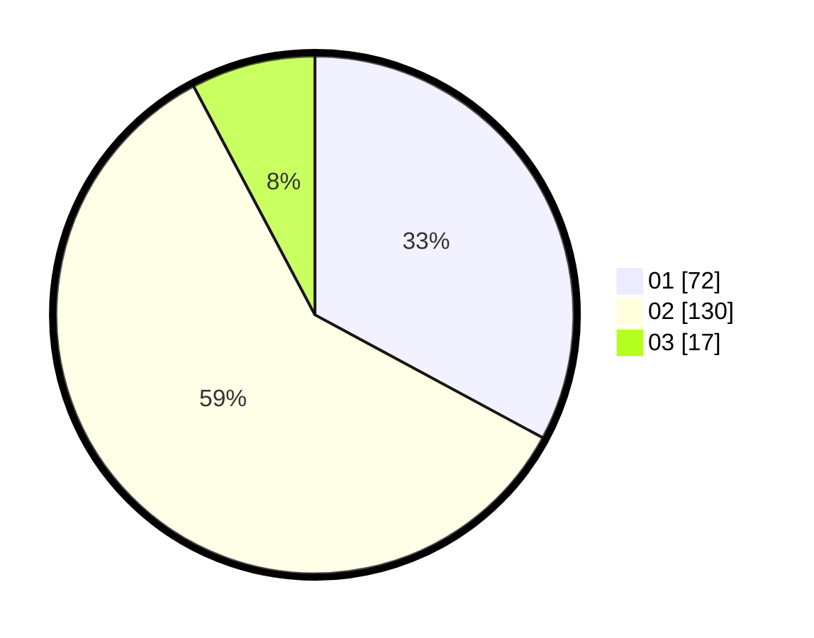

# Hasil

Hasil perolehan suara paslon dapat dilihat pada file paslon-01.txt, paslon-02.txt, dan paslon-03.txt.

Jika tidak ada, artinya data tersebut belum ada pada SIREKAP.

## Perolehan Suara

 * Paslon 01: **72**.
 * Paslon 02: **130**.
 * Paslon 03: **17**.

## Foto C Plano

https://sirekap-obj-formc.kpu.go.id/8758/pemilu/ppwp/31/75/05/10/05/3175051005142-20240214-155742--beabf7e0-ff90-489c-a24b-668f9e4cfd7b.jpg

https://sirekap-obj-formc.kpu.go.id/8758/pemilu/ppwp/31/75/05/10/05/3175051005142-20240214-160057--60dfc892-00b6-440e-bbb4-dcfab65dd6bc.jpg

https://sirekap-obj-formc.kpu.go.id/8758/pemilu/ppwp/31/75/05/10/05/3175051005142-20240214-155918--8a0e7f2b-5cb2-45ba-81bf-81f78b2be9cc.jpg

## DATA PEMILIH TETAP

Jumlah pemilih dalam DPT: **272**.
 * L: **138**.
 * P: **134**.

## DATA PENGGUNA HAK PILIH

Jumlah pengguna hak pilih dalam DPT: **220**.
 * L: **112**.
 * P: **108**.

Jumlah pengguna hak pilih dalam DPTb: **0**.
 * L: **0**.
 * P: **0**.

Jumlah pengguna hak pilih dalam DPK: **0**.
 * L: **0**.
 * P: **0**.

Jumlah pengguna hak pilih: **220**.
 * L: **112**.
 * P: **108**.

## JUMLAH SUARA SAH DAN TIDAK SAH

JUMLAH SELURUH SUARA SAH: **219**.

JUMLAH SUARA TIDAK SAH: **1**.

JUMLAH SELURUH SUARA SAH DAN SUARA TIDAK SAH: **220**.
