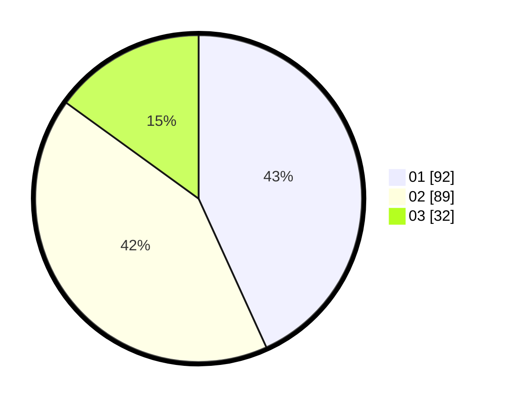

# Hasil

Hasil perolehan suara paslon dapat dilihat pada file paslon-01.txt, paslon-02.txt, dan paslon-03.txt.

Jika tidak ada, artinya data tersebut belum ada pada SIREKAP.

## Perolehan Suara

 * Paslon 01: **92**.
 * Paslon 02: **89**.
 * Paslon 03: **32**.

## Foto C Plano

https://sirekap-obj-formc.kpu.go.id/003b/pemilu/ppwp/31/75/06/10/01/3175061001018-20240215-021701--1c6c0b3a-a69c-492a-9de6-f1aa36da24ab.jpg

https://sirekap-obj-formc.kpu.go.id/003b/pemilu/ppwp/31/75/06/10/01/3175061001018-20240214-155445--a9a5aa05-cdeb-4bc2-8a12-20dd20c60db7.jpg

https://sirekap-obj-formc.kpu.go.id/003b/pemilu/ppwp/31/75/06/10/01/3175061001018-20240215-021802--2e397aab-f646-4fad-ae4d-7778e3af2e3f.jpg

## DATA PEMILIH TETAP

Jumlah pemilih dalam DPT: **276**.
 * L: **135**.
 * P: **141**.

## DATA PENGGUNA HAK PILIH

Jumlah pengguna hak pilih dalam DPT: **215**.
 * L: **100**.
 * P: **115**.

Jumlah pengguna hak pilih dalam DPTb: **0**.
 * L: **0**.
 * P: **0**.

Jumlah pengguna hak pilih dalam DPK: **0**.
 * L: **0**.
 * P: **0**.

Jumlah pengguna hak pilih: **215**.
 * L: **100**.
 * P: **115**.

## JUMLAH SUARA SAH DAN TIDAK SAH

JUMLAH SELURUH SUARA SAH: **213**.

JUMLAH SUARA TIDAK SAH: **2**.

JUMLAH SELURUH SUARA SAH DAN SUARA TIDAK SAH: **215**.
