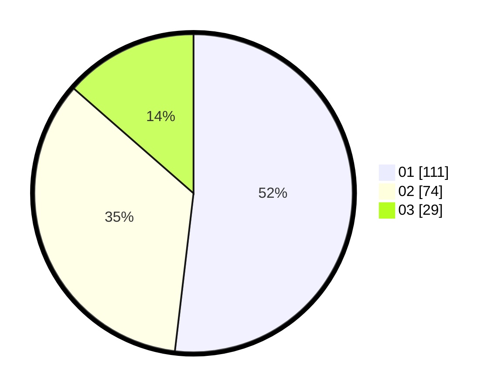

# Hasil

Hasil perolehan suara paslon dapat dilihat pada file paslon-01.txt, paslon-02.txt, dan paslon-03.txt.

Jika tidak ada, artinya data tersebut belum ada pada SIREKAP.

## Perolehan Suara

 * Paslon 01: **111**.
 * Paslon 02: **74**.
 * Paslon 03: **29**.

## Foto C Plano

https://sirekap-obj-formc.kpu.go.id/b47b/pemilu/ppwp/31/75/06/10/01/3175061001019-20240215-215320--ac1a4bee-f771-455e-97d8-5b3389f2fb44.jpg

https://sirekap-obj-formc.kpu.go.id/b47b/pemilu/ppwp/31/75/06/10/01/3175061001019-20240215-215326--1182e579-ac5a-4317-a1d2-e0ae940f5601.jpg

https://sirekap-obj-formc.kpu.go.id/b47b/pemilu/ppwp/31/75/06/10/01/3175061001019-20240215-215331--1a7f870b-125b-4e7d-92d6-d54727fed6f9.jpg

## DATA PEMILIH TETAP

Jumlah pemilih dalam DPT: **277**.
 * L: **134**.
 * P: **143**.

## DATA PENGGUNA HAK PILIH

Jumlah pengguna hak pilih dalam DPT: **214**.
 * L: **100**.
 * P: **114**.

Jumlah pengguna hak pilih dalam DPTb: **1**.
 * L: **0**.
 * P: **1**.

Jumlah pengguna hak pilih dalam DPK: **0**.
 * L: **0**.
 * P: **0**.

Jumlah pengguna hak pilih: **215**.
 * L: **100**.
 * P: **115**.

## JUMLAH SUARA SAH DAN TIDAK SAH

JUMLAH SELURUH SUARA SAH: **214**.

JUMLAH SUARA TIDAK SAH: **1**.

JUMLAH SELURUH SUARA SAH DAN SUARA TIDAK SAH: **215**.
