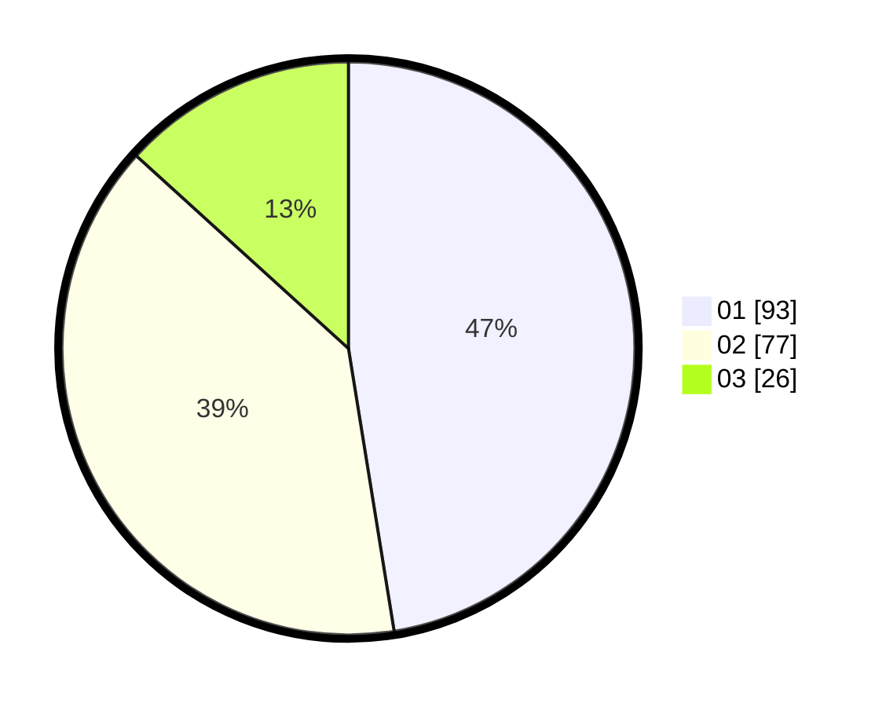

# Hasil

Hasil perolehan suara paslon dapat dilihat pada file paslon-01.txt, paslon-02.txt, dan paslon-03.txt.

Jika tidak ada, artinya data tersebut belum ada pada SIREKAP.

## Perolehan Suara

 * Paslon 01: **93**.
 * Paslon 02: **77**.
 * Paslon 03: **26**.

## Foto C Plano

https://sirekap-obj-formc.kpu.go.id/c57e/pemilu/ppwp/31/75/06/10/01/3175061001022-20240214-221407--2cd09235-bd6c-4636-aef1-0a045137811b.jpg

https://sirekap-obj-formc.kpu.go.id/c57e/pemilu/ppwp/31/75/06/10/01/3175061001022-20240214-221828--44e192a3-fe4d-43c0-b16b-dc0f08fd299d.jpg

https://sirekap-obj-formc.kpu.go.id/c57e/pemilu/ppwp/31/75/06/10/01/3175061001022-20240214-221918--78f20096-36ea-488b-bded-a82ad8751d7a.jpg

## DATA PEMILIH TETAP

Jumlah pemilih dalam DPT: **257**.
 * L: **133**.
 * P: **124**.

## DATA PENGGUNA HAK PILIH

Jumlah pengguna hak pilih dalam DPT: **193**.
 * L: **100**.
 * P: **93**.

Jumlah pengguna hak pilih dalam DPTb: **0**.
 * L: **0**.
 * P: **0**.

Jumlah pengguna hak pilih dalam DPK: **6**.
 * L: **2**.
 * P: **4**.

Jumlah pengguna hak pilih: **199**.
 * L: **102**.
 * P: **97**.

## JUMLAH SUARA SAH DAN TIDAK SAH

JUMLAH SELURUH SUARA SAH: **196**.

JUMLAH SUARA TIDAK SAH: **3**.

JUMLAH SELURUH SUARA SAH DAN SUARA TIDAK SAH: **199**.
