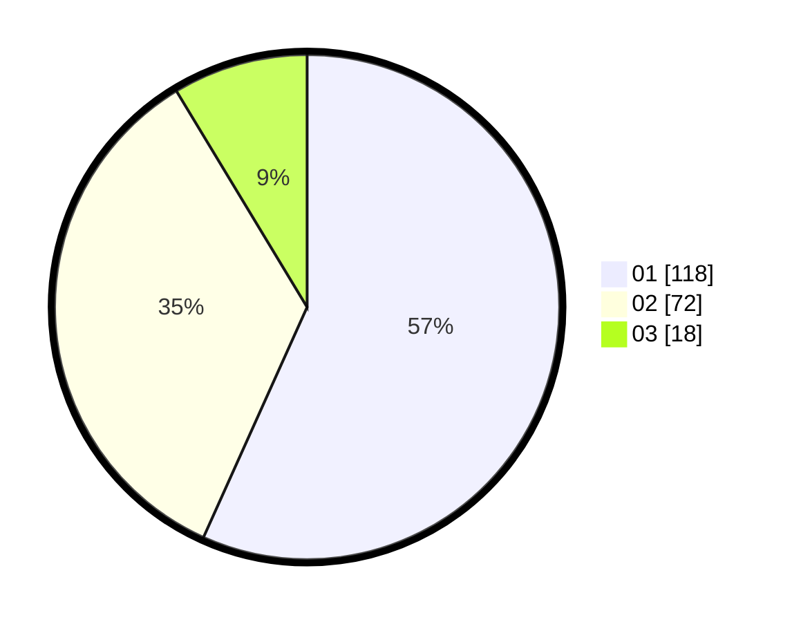

# Hasil

Hasil perolehan suara paslon dapat dilihat pada file paslon-01.txt, paslon-02.txt, dan paslon-03.txt.

Jika tidak ada, artinya data tersebut belum ada pada SIREKAP.

## Perolehan Suara

 * Paslon 01: **118**.
 * Paslon 02: **72**.
 * Paslon 03: **18**.

## Foto C Plano

https://sirekap-obj-formc.kpu.go.id/04a4/pemilu/ppwp/31/75/06/10/01/3175061001024-20240214-200236--e53e1eb3-f8a6-4e2a-abcc-a34e9b844398.jpg

https://sirekap-obj-formc.kpu.go.id/04a4/pemilu/ppwp/31/75/06/10/01/3175061001024-20240214-200449--ab463b64-5678-4d28-b09a-0f669e9cf7ae.jpg

https://sirekap-obj-formc.kpu.go.id/04a4/pemilu/ppwp/31/75/06/10/01/3175061001024-20240214-200648--a2dac88e-6173-4a0d-bf84-08291b957457.jpg

## DATA PEMILIH TETAP

Jumlah pemilih dalam DPT: **256**.
 * L: **136**.
 * P: **120**.

## DATA PENGGUNA HAK PILIH

Jumlah pengguna hak pilih dalam DPT: **210**.
 * L: **107**.
 * P: **103**.

Jumlah pengguna hak pilih dalam DPTb: **0**.
 * L: **0**.
 * P: **0**.

Jumlah pengguna hak pilih dalam DPK: **1**.
 * L: **1**.
 * P: **0**.

Jumlah pengguna hak pilih: **211**.
 * L: **108**.
 * P: **103**.

## JUMLAH SUARA SAH DAN TIDAK SAH

JUMLAH SELURUH SUARA SAH: **208**.

JUMLAH SUARA TIDAK SAH: **3**.

JUMLAH SELURUH SUARA SAH DAN SUARA TIDAK SAH: **211**.
