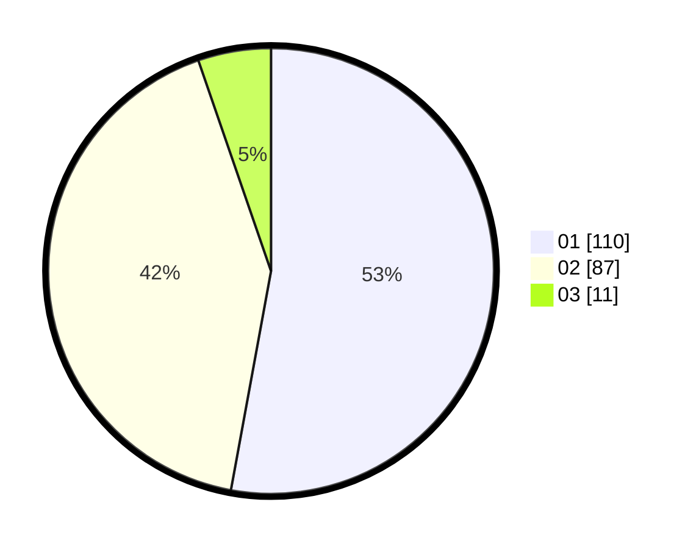

# Hasil

Hasil perolehan suara paslon dapat dilihat pada file paslon-01.txt, paslon-02.txt, dan paslon-03.txt.

Jika tidak ada, artinya data tersebut belum ada pada SIREKAP.

## Perolehan Suara

 * Paslon 01: **110**.
 * Paslon 02: **87**.
 * Paslon 03: **11**.

## Foto C Plano

https://sirekap-obj-formc.kpu.go.id/d8c2/pemilu/ppwp/31/75/06/10/01/3175061001031-20240214-193028--7de2473f-69b2-4eb6-9d89-4ce594ea2aee.jpg

https://sirekap-obj-formc.kpu.go.id/d8c2/pemilu/ppwp/31/75/06/10/01/3175061001031-20240214-193643--7e7236ff-9a24-42ed-b5ab-1a9b2ecb7cbb.jpg

https://sirekap-obj-formc.kpu.go.id/d8c2/pemilu/ppwp/31/75/06/10/01/3175061001031-20240214-193213--d8167efb-2929-4ae1-b7bd-81bc873e2b2a.jpg

## DATA PEMILIH TETAP

Jumlah pemilih dalam DPT: **256**.
 * L: **122**.
 * P: **134**.

## DATA PENGGUNA HAK PILIH

Jumlah pengguna hak pilih dalam DPT: **208**.
 * L: **98**.
 * P: **110**.

Jumlah pengguna hak pilih dalam DPTb: **2**.
 * L: **1**.
 * P: **1**.

Jumlah pengguna hak pilih dalam DPK: **0**.
 * L: **0**.
 * P: **0**.

Jumlah pengguna hak pilih: **210**.
 * L: **99**.
 * P: **111**.

## JUMLAH SUARA SAH DAN TIDAK SAH

JUMLAH SELURUH SUARA SAH: **208**.

JUMLAH SUARA TIDAK SAH: **2**.

JUMLAH SELURUH SUARA SAH DAN SUARA TIDAK SAH: **210**.
