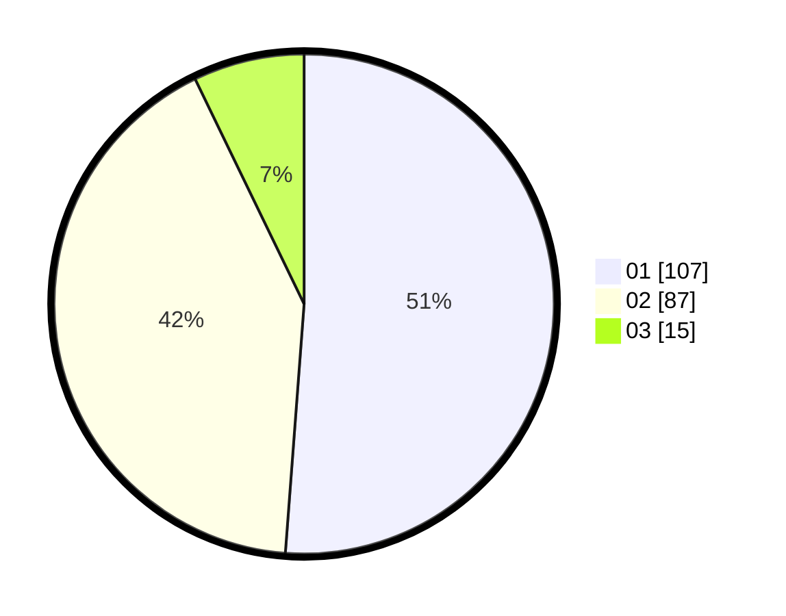

# Hasil

Hasil perolehan suara paslon dapat dilihat pada file paslon-01.txt, paslon-02.txt, dan paslon-03.txt.

Jika tidak ada, artinya data tersebut belum ada pada SIREKAP.

## Perolehan Suara

 * Paslon 01: **107**.
 * Paslon 02: **87**.
 * Paslon 03: **15**.

## Foto C Plano

https://sirekap-obj-formc.kpu.go.id/8216/pemilu/ppwp/31/75/06/10/01/3175061001038-20240214-223449--97e33047-6ec2-4fad-8fa8-4bd794cf3eba.jpg

https://sirekap-obj-formc.kpu.go.id/8216/pemilu/ppwp/31/75/06/10/01/3175061001038-20240214-223553--e81a8b93-d2ea-485f-a91e-cb9760415ba6.jpg

https://sirekap-obj-formc.kpu.go.id/8216/pemilu/ppwp/31/75/06/10/01/3175061001038-20240214-223730--32fb656a-2fa5-4cfa-aafd-fd5bcc47cebc.jpg

## DATA PEMILIH TETAP

Jumlah pemilih dalam DPT: **264**.
 * L: **130**.
 * P: **134**.

## DATA PENGGUNA HAK PILIH

Jumlah pengguna hak pilih dalam DPT: **210**.
 * L: **103**.
 * P: **107**.

Jumlah pengguna hak pilih dalam DPTb: **0**.
 * L: **0**.
 * P: **0**.

Jumlah pengguna hak pilih dalam DPK: **2**.
 * L: **1**.
 * P: **1**.

Jumlah pengguna hak pilih: **212**.
 * L: **104**.
 * P: **108**.

## JUMLAH SUARA SAH DAN TIDAK SAH

JUMLAH SELURUH SUARA SAH: **209**.

JUMLAH SUARA TIDAK SAH: **3**.

JUMLAH SELURUH SUARA SAH DAN SUARA TIDAK SAH: **212**.
