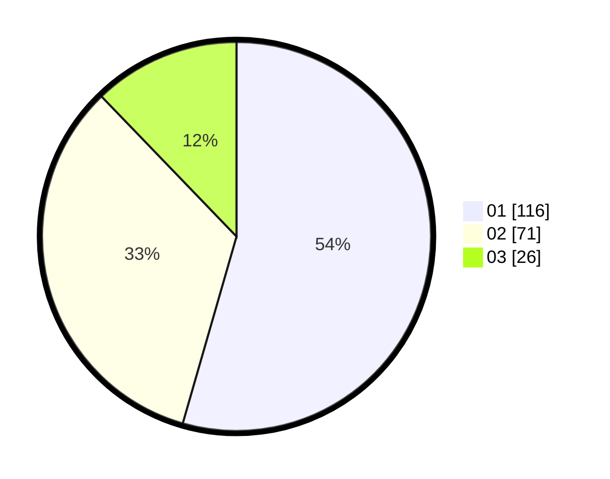

# Hasil

Hasil perolehan suara paslon dapat dilihat pada file paslon-01.txt, paslon-02.txt, dan paslon-03.txt.

Jika tidak ada, artinya data tersebut belum ada pada SIREKAP.

## Perolehan Suara

 * Paslon 01: **116**.
 * Paslon 02: **71**.
 * Paslon 03: **26**.

## Foto C Plano

https://sirekap-obj-formc.kpu.go.id/e18e/pemilu/ppwp/31/75/06/10/01/3175061001039-20240214-215215--5e874149-4fa9-4571-9f15-a88f74e8a46a.jpg

https://sirekap-obj-formc.kpu.go.id/e18e/pemilu/ppwp/31/75/06/10/01/3175061001039-20240214-215338--adbf4bb5-dc4a-48b8-a731-c1ac4d6a538a.jpg

https://sirekap-obj-formc.kpu.go.id/e18e/pemilu/ppwp/31/75/06/10/01/3175061001039-20240214-215448--52726428-358d-472b-979c-8c1e4af2185b.jpg
