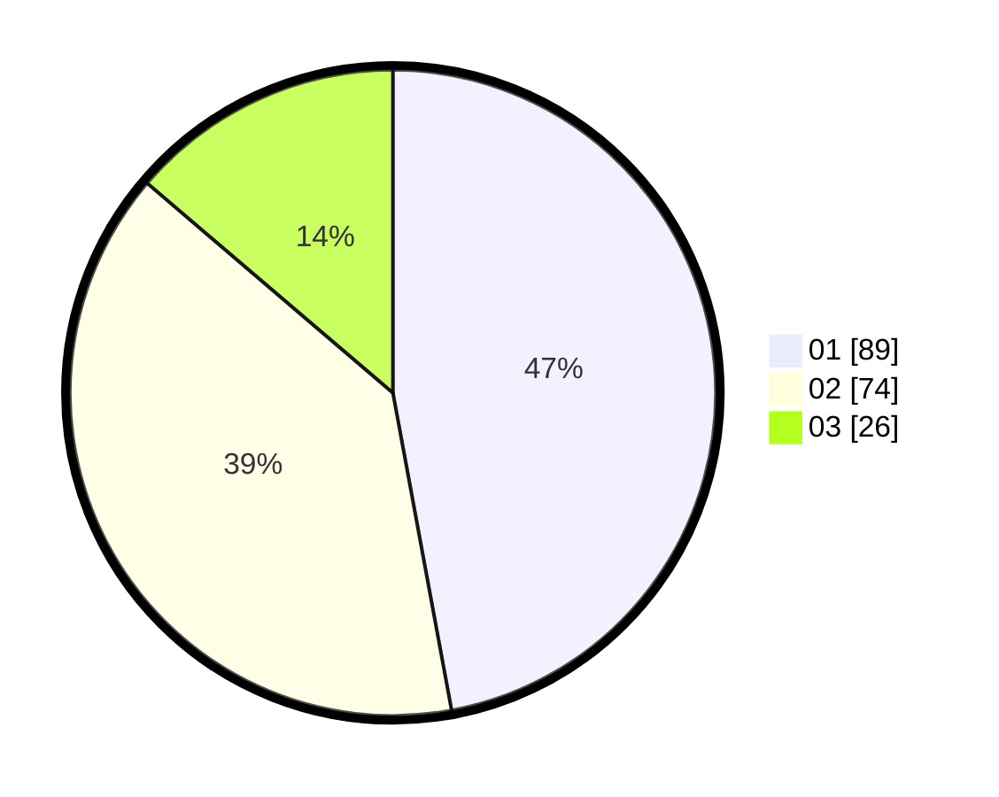

# Hasil

Hasil perolehan suara paslon dapat dilihat pada file paslon-01.txt, paslon-02.txt, dan paslon-03.txt.

Jika tidak ada, artinya data tersebut belum ada pada SIREKAP.

## Perolehan Suara

 * Paslon 01: **89**.
 * Paslon 02: **74**.
 * Paslon 03: **26**.

## Foto C Plano

https://sirekap-obj-formc.kpu.go.id/6ffb/pemilu/ppwp/31/75/06/10/01/3175061001047-20240214-221515--b8d13fd1-e4fc-484d-bd7c-4add8244e464.jpg

https://sirekap-obj-formc.kpu.go.id/6ffb/pemilu/ppwp/31/75/06/10/01/3175061001047-20240214-221801--2ab1ffbe-aca7-4316-a627-b14e452d4abb.jpg

https://sirekap-obj-formc.kpu.go.id/6ffb/pemilu/ppwp/31/75/06/10/01/3175061001047-20240214-222009--72f8f992-d669-4894-b06b-6e4bb7e99902.jpg
