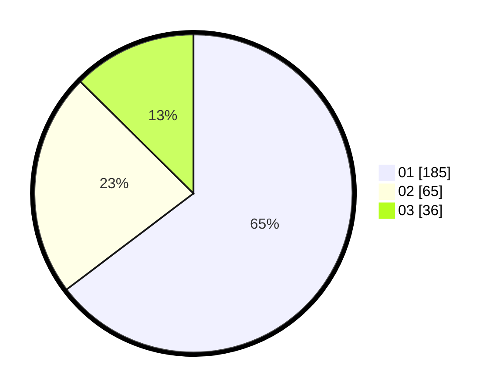

# Hasil

Hasil perolehan suara paslon dapat dilihat pada file paslon-01.txt, paslon-02.txt, dan paslon-03.txt.

Jika tidak ada, artinya data tersebut belum ada pada SIREKAP.

## Perolehan Suara

 * Paslon 01: **185**.
 * Paslon 02: **65**.
 * Paslon 03: **36**.

## Foto C Plano

https://sirekap-obj-formc.kpu.go.id/67c4/pemilu/ppwp/31/75/06/10/01/3175061001050-20240216-122437--5a3c6316-7b53-4452-be04-8acc00c8dabd.jpg

https://sirekap-obj-formc.kpu.go.id/67c4/pemilu/ppwp/31/75/06/10/01/3175061001050-20240216-122515--dfdb8193-558e-4af0-a919-301dba702add.jpg

https://sirekap-obj-formc.kpu.go.id/67c4/pemilu/ppwp/31/75/06/10/01/3175061001050-20240216-122556--a131df3b-ff1b-4320-9905-0bb07da7062f.jpg
