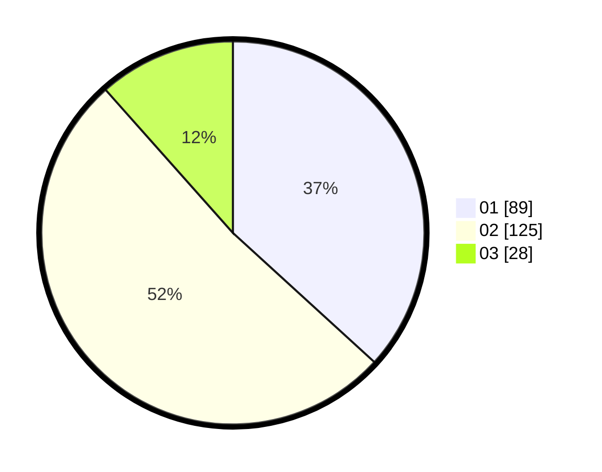

# Hasil

Hasil perolehan suara paslon dapat dilihat pada file paslon-01.txt, paslon-02.txt, dan paslon-03.txt.

Jika tidak ada, artinya data tersebut belum ada pada SIREKAP.

## Perolehan Suara

 * Paslon 01: **89**.
 * Paslon 02: **125**.
 * Paslon 03: **28**.

## Foto C Plano

https://sirekap-obj-formc.kpu.go.id/fce3/pemilu/ppwp/31/75/06/10/01/3175061001053-20240214-200333--dbb4785f-41a9-4fd4-ac1e-84675cfb28e3.jpg

https://sirekap-obj-formc.kpu.go.id/fce3/pemilu/ppwp/31/75/06/10/01/3175061001053-20240214-200451--36bc6cec-8176-49c0-ade8-7b0de3465fd5.jpg

https://sirekap-obj-formc.kpu.go.id/fce3/pemilu/ppwp/31/75/06/10/01/3175061001053-20240214-200612--4f4baedd-4b54-4d95-9aed-e99083270a86.jpg
