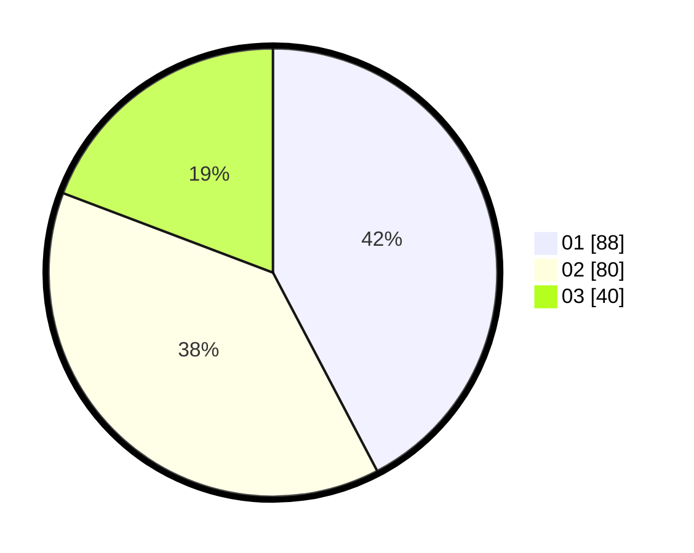

# Hasil

Hasil perolehan suara paslon dapat dilihat pada file paslon-01.txt, paslon-02.txt, dan paslon-03.txt.

Jika tidak ada, artinya data tersebut belum ada pada SIREKAP.

## Perolehan Suara

 * Paslon 01: **88**.
 * Paslon 02: **80**.
 * Paslon 03: **40**.

## Foto C Plano

https://sirekap-obj-formc.kpu.go.id/1695/pemilu/ppwp/31/75/06/10/01/3175061001055-20240214-203458--60e5ec57-c422-44d6-8d1c-c8a7729d4134.jpg

https://sirekap-obj-formc.kpu.go.id/1695/pemilu/ppwp/31/75/06/10/01/3175061001055-20240214-203605--06e1b40c-7869-487d-b0cf-037436c5854b.jpg

https://sirekap-obj-formc.kpu.go.id/1695/pemilu/ppwp/31/75/06/10/01/3175061001055-20240214-203701--0e6b7b96-1c9f-4f93-89dc-be4d99b06b56.jpg
