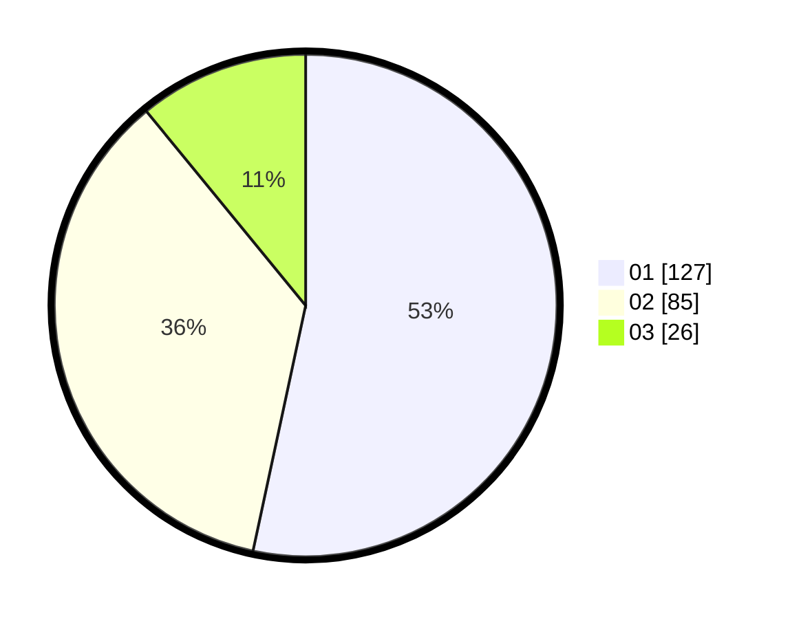

# Hasil

Hasil perolehan suara paslon dapat dilihat pada file paslon-01.txt, paslon-02.txt, dan paslon-03.txt.

Jika tidak ada, artinya data tersebut belum ada pada SIREKAP.

## Perolehan Suara

 * Paslon 01: **127**.
 * Paslon 02: **85**.
 * Paslon 03: **26**.

## Foto C Plano

https://sirekap-obj-formc.kpu.go.id/1e2c/pemilu/ppwp/31/75/06/10/01/3175061001062-20240215-022223--701e77f5-9177-49e6-a4a4-1639f8447367.jpg

https://sirekap-obj-formc.kpu.go.id/1e2c/pemilu/ppwp/31/75/06/10/01/3175061001062-20240215-022335--f834ee49-281a-447f-b2c7-4b945ed1d779.jpg

https://sirekap-obj-formc.kpu.go.id/1e2c/pemilu/ppwp/31/75/06/10/01/3175061001062-20240215-022513--8a74392d-5292-49bd-8808-5f528fc20773.jpg

## DATA PEMILIH TETAP

Jumlah pemilih dalam DPT: **266**.
 * L: **133**.
 * P: **133**.

## DATA PENGGUNA HAK PILIH

Jumlah pengguna hak pilih dalam DPT: **226**.
 * L: **114**.
 * P: **112**.

Jumlah pengguna hak pilih dalam DPTb: **12**.
 * L: **6**.
 * P: **6**.

Jumlah pengguna hak pilih dalam DPK: **2**.
 * L: **0**.
 * P: **2**.

Jumlah pengguna hak pilih: **240**.
 * L: **120**.
 * P: **120**.

## JUMLAH SUARA SAH DAN TIDAK SAH

JUMLAH SELURUH SUARA SAH: **238**.

JUMLAH SUARA TIDAK SAH: **2**.

JUMLAH SELURUH SUARA SAH DAN SUARA TIDAK SAH: **240**.
