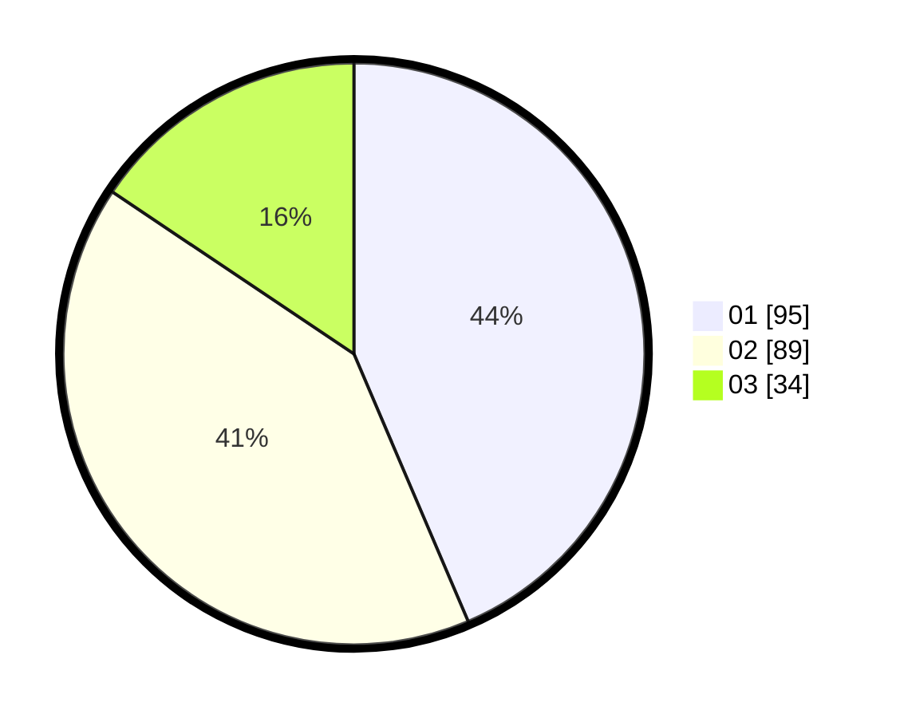

# Hasil

Hasil perolehan suara paslon dapat dilihat pada file paslon-01.txt, paslon-02.txt, dan paslon-03.txt.

Jika tidak ada, artinya data tersebut belum ada pada SIREKAP.

## Perolehan Suara

 * Paslon 01: **95**.
 * Paslon 02: **89**.
 * Paslon 03: **34**.

## Foto C Plano

https://sirekap-obj-formc.kpu.go.id/6a06/pemilu/ppwp/31/75/06/10/01/3175061001092-20240216-092452--dbc40b87-fa7a-4554-afb8-b2b6ca7ea687.jpg

https://sirekap-obj-formc.kpu.go.id/6a06/pemilu/ppwp/31/75/06/10/01/3175061001092-20240216-035444--cd88d779-ce91-41ff-aaad-718ed622a2da.jpg

https://sirekap-obj-formc.kpu.go.id/6a06/pemilu/ppwp/31/75/06/10/01/3175061001092-20240214-201103--02b65493-f42a-4fe6-94b0-59ea58906693.jpg

## DATA PEMILIH TETAP

Jumlah pemilih dalam DPT: **262**.
 * L: **138**.
 * P: **124**.

## DATA PENGGUNA HAK PILIH

Jumlah pengguna hak pilih dalam DPT: **215**.
 * L: **111**.
 * P: **104**.

Jumlah pengguna hak pilih dalam DPTb: **4**.
 * L: **1**.
 * P: **3**.

Jumlah pengguna hak pilih dalam DPK: **1**.
 * L: **1**.
 * P: **0**.

Jumlah pengguna hak pilih: **220**.
 * L: **113**.
 * P: **107**.

## JUMLAH SUARA SAH DAN TIDAK SAH

JUMLAH SELURUH SUARA SAH: **218**.

JUMLAH SUARA TIDAK SAH: **2**.

JUMLAH SELURUH SUARA SAH DAN SUARA TIDAK SAH: **220**.
