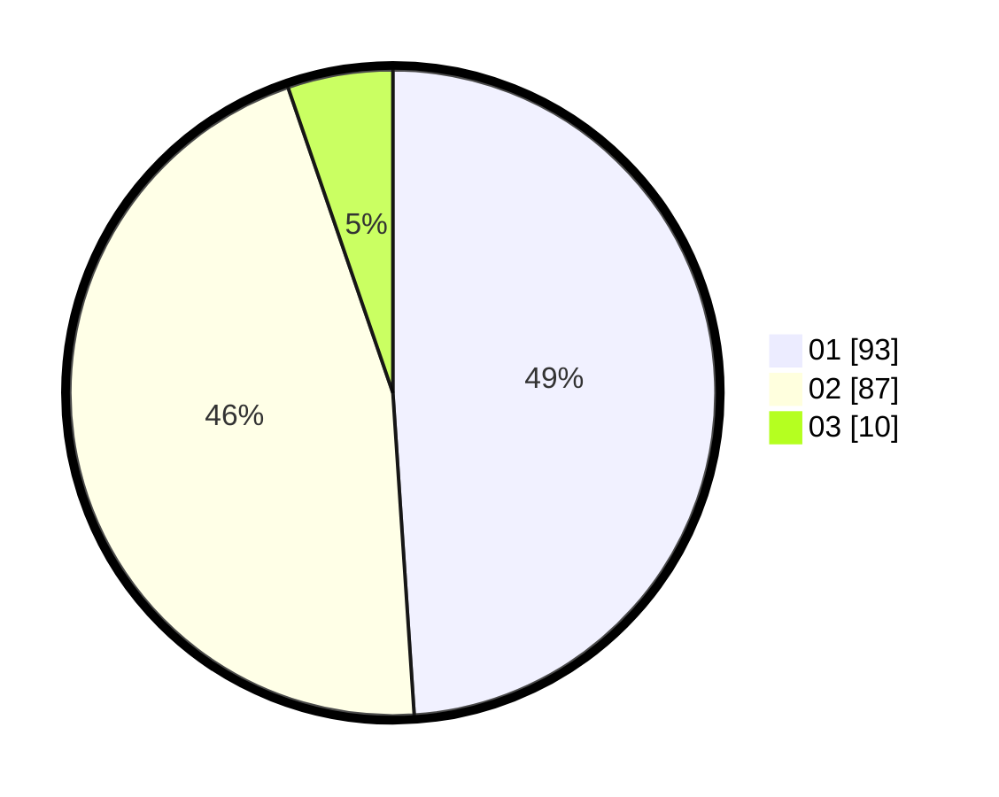

# Hasil

Hasil perolehan suara paslon dapat dilihat pada file paslon-01.txt, paslon-02.txt, dan paslon-03.txt.

Jika tidak ada, artinya data tersebut belum ada pada SIREKAP.

## Perolehan Suara

 * Paslon 01: **93**.
 * Paslon 02: **87**.
 * Paslon 03: **10**.

## Foto C Plano

https://sirekap-obj-formc.kpu.go.id/382b/pemilu/ppwp/31/75/06/10/01/3175061001102-20240214-201150--6fb0bb8b-434f-4ed8-9089-a361e9fe8490.jpg

https://sirekap-obj-formc.kpu.go.id/382b/pemilu/ppwp/31/75/06/10/01/3175061001102-20240214-201328--fee27ef5-55c7-4d18-85a0-d812c44f575a.jpg

https://sirekap-obj-formc.kpu.go.id/382b/pemilu/ppwp/31/75/06/10/01/3175061001102-20240214-201446--d0a6cb59-46ed-4975-b04f-1c2431427237.jpg

## DATA PEMILIH TETAP

Jumlah pemilih dalam DPT: **256**.
 * L: **132**.
 * P: **124**.

## DATA PENGGUNA HAK PILIH

Jumlah pengguna hak pilih dalam DPT: **184**.
 * L: **91**.
 * P: **93**.

Jumlah pengguna hak pilih dalam DPTb: **0**.
 * L: **0**.
 * P: **0**.

Jumlah pengguna hak pilih dalam DPK: **12**.
 * L: **8**.
 * P: **4**.

Jumlah pengguna hak pilih: **196**.
 * L: **99**.
 * P: **97**.

## JUMLAH SUARA SAH DAN TIDAK SAH

JUMLAH SELURUH SUARA SAH: **190**.

JUMLAH SUARA TIDAK SAH: **6**.

JUMLAH SELURUH SUARA SAH DAN SUARA TIDAK SAH: **196**.
