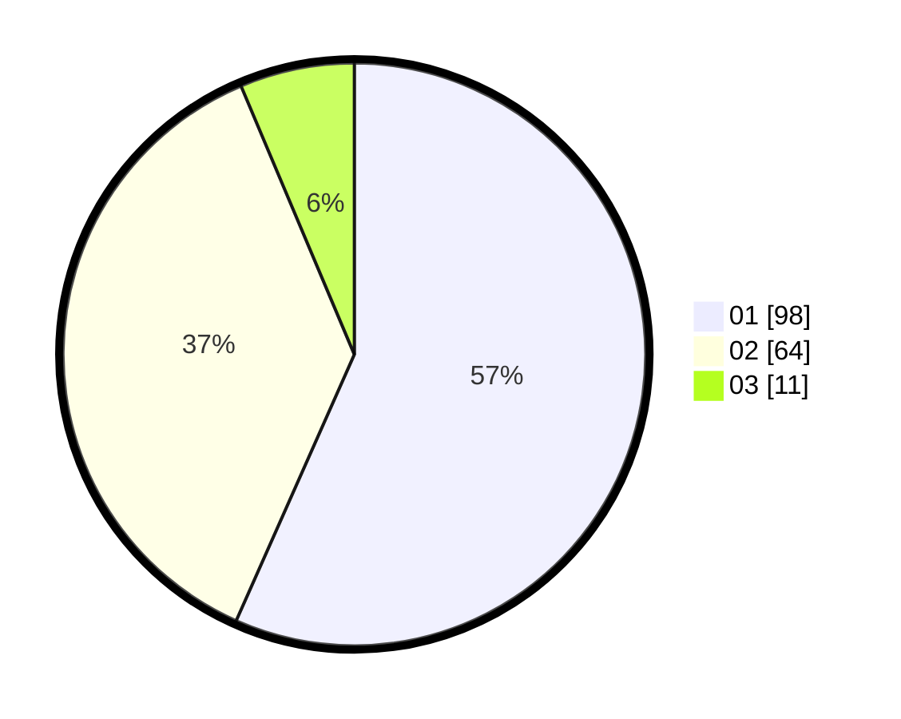

# Hasil

Hasil perolehan suara paslon dapat dilihat pada file paslon-01.txt, paslon-02.txt, dan paslon-03.txt.

Jika tidak ada, artinya data tersebut belum ada pada SIREKAP.

## Perolehan Suara

 * Paslon 01: **98**.
 * Paslon 02: **64**.
 * Paslon 03: **11**.

## Foto C Plano

https://sirekap-obj-formc.kpu.go.id/8de2/pemilu/ppwp/31/75/06/10/01/3175061001106-20240215-001649--3c08803f-019a-4939-b542-5e2927f1bff5.jpg

https://sirekap-obj-formc.kpu.go.id/8de2/pemilu/ppwp/31/75/06/10/01/3175061001106-20240215-002922--5a813d22-4cd5-4022-8cfb-77bba33c81d2.jpg

https://sirekap-obj-formc.kpu.go.id/8de2/pemilu/ppwp/31/75/06/10/01/3175061001106-20240215-003104--b3476451-be97-4bdf-9e7c-b40d41b0e47e.jpg
