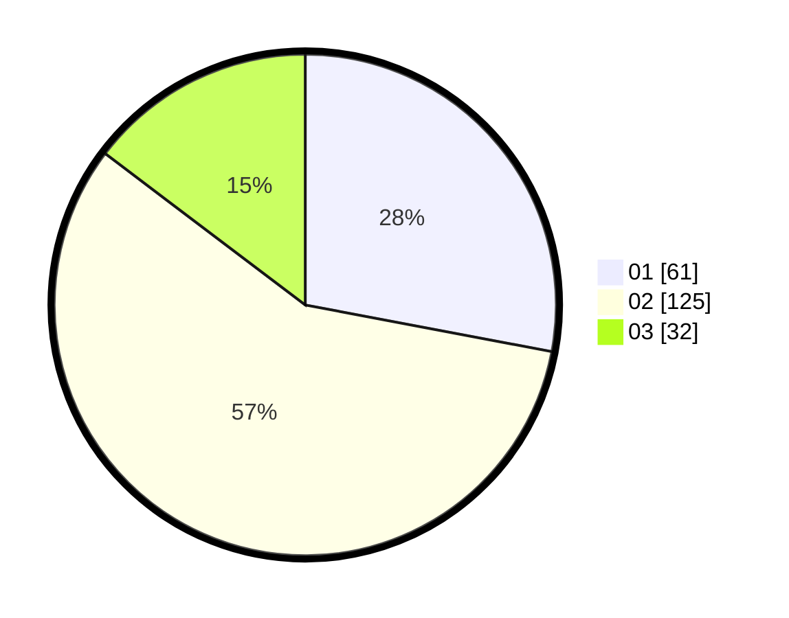

# Hasil

Hasil perolehan suara paslon dapat dilihat pada file paslon-01.txt, paslon-02.txt, dan paslon-03.txt.

Jika tidak ada, artinya data tersebut belum ada pada SIREKAP.

## Perolehan Suara

 * Paslon 01: **61**.
 * Paslon 02: **125**.
 * Paslon 03: **32**.

## Foto C Plano

https://sirekap-obj-formc.kpu.go.id/cef4/pemilu/ppwp/31/75/06/10/01/3175061001118-20240214-221922--4f2e58f5-1613-4899-95ca-9ad1bf1bd529.jpg

https://sirekap-obj-formc.kpu.go.id/cef4/pemilu/ppwp/31/75/06/10/01/3175061001118-20240214-221532--742b828e-00e4-45ab-a69a-43dce0a54f09.jpg

https://sirekap-obj-formc.kpu.go.id/cef4/pemilu/ppwp/31/75/06/10/01/3175061001118-20240214-221722--e5eb10eb-f2b1-48fe-a8fc-9f42405f0102.jpg
