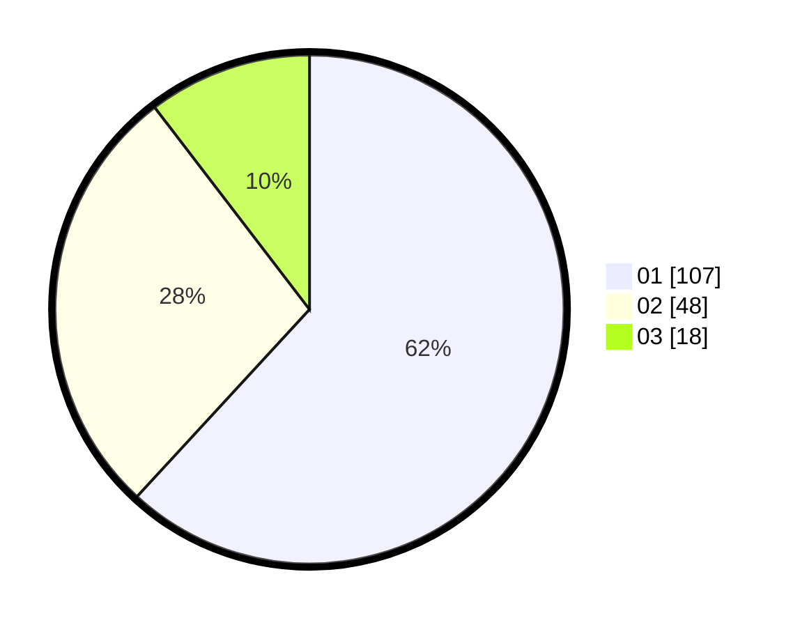

# Hasil

Hasil perolehan suara paslon dapat dilihat pada file paslon-01.txt, paslon-02.txt, dan paslon-03.txt.

Jika tidak ada, artinya data tersebut belum ada pada SIREKAP.

## Perolehan Suara

 * Paslon 01: **107**.
 * Paslon 02: **48**.
 * Paslon 03: **18**.

## Foto C Plano

https://sirekap-obj-formc.kpu.go.id/984e/pemilu/ppwp/31/75/06/10/01/3175061001122-20240214-222225--6ae09395-3e06-412f-aee9-545e6a824a0d.jpg

https://sirekap-obj-formc.kpu.go.id/984e/pemilu/ppwp/31/75/06/10/01/3175061001122-20240215-001042--a8ab1120-74d9-4214-84ba-da60a72b7874.jpg

https://sirekap-obj-formc.kpu.go.id/984e/pemilu/ppwp/31/75/06/10/01/3175061001122-20240214-222353--296d91de-baa6-4387-9642-a85fa78c1b64.jpg
