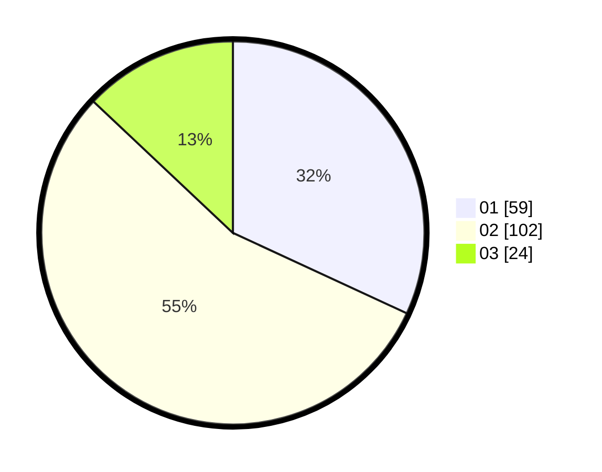

# Hasil

Hasil perolehan suara paslon dapat dilihat pada file paslon-01.txt, paslon-02.txt, dan paslon-03.txt.

Jika tidak ada, artinya data tersebut belum ada pada SIREKAP.

## Perolehan Suara

 * Paslon 01: **59**.
 * Paslon 02: **102**.
 * Paslon 03: **24**.

## Foto C Plano

https://sirekap-obj-formc.kpu.go.id/3845/pemilu/ppwp/31/75/06/10/01/3175061001140-20240214-204849--39a7c17e-b3a4-4422-8955-a95b3322a0a6.jpg

https://sirekap-obj-formc.kpu.go.id/3845/pemilu/ppwp/31/75/06/10/01/3175061001140-20240214-205837--a1ab1733-45ad-48db-95fd-7feda8cc9f3f.jpg

https://sirekap-obj-formc.kpu.go.id/3845/pemilu/ppwp/31/75/06/10/01/3175061001140-20240214-210021--a5468aa6-96aa-4b41-b1b5-6df1c33249a4.jpg
