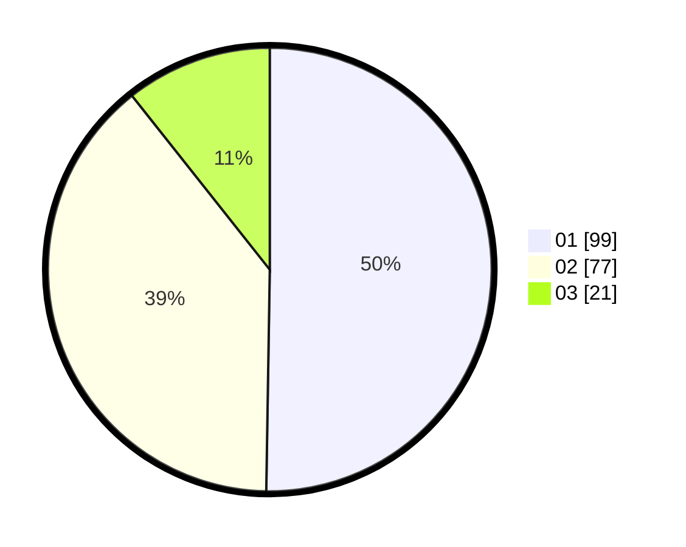

# Hasil

Hasil perolehan suara paslon dapat dilihat pada file paslon-01.txt, paslon-02.txt, dan paslon-03.txt.

Jika tidak ada, artinya data tersebut belum ada pada SIREKAP.

## Perolehan Suara

 * Paslon 01: **99**.
 * Paslon 02: **77**.
 * Paslon 03: **21**.

## Foto C Plano

https://sirekap-obj-formc.kpu.go.id/abd9/pemilu/ppwp/31/75/06/10/01/3175061001142-20240214-141040--a015a173-c1ab-4230-8610-24af36f0d907.jpg

https://sirekap-obj-formc.kpu.go.id/abd9/pemilu/ppwp/31/75/06/10/01/3175061001142-20240214-155107--ed73e3c8-445c-45a8-8eb1-44c363b9fb3c.jpg

https://sirekap-obj-formc.kpu.go.id/abd9/pemilu/ppwp/31/75/06/10/01/3175061001142-20240214-155715--5e5cf73a-f30d-4910-9090-94fbf0af9db3.jpg

## DATA PEMILIH TETAP

Jumlah pemilih dalam DPT: **277**.
 * L: **148**.
 * P: **129**.

## DATA PENGGUNA HAK PILIH

Jumlah pengguna hak pilih dalam DPT: **197**.
 * L: **103**.
 * P: **94**.

Jumlah pengguna hak pilih dalam DPTb: **0**.
 * L: **0**.
 * P: **0**.

Jumlah pengguna hak pilih dalam DPK: **0**.
 * L: **0**.
 * P: **0**.

Jumlah pengguna hak pilih: **197**.
 * L: **103**.
 * P: **94**.

## JUMLAH SUARA SAH DAN TIDAK SAH

JUMLAH SELURUH SUARA SAH: **197**.

JUMLAH SUARA TIDAK SAH: **0**.

JUMLAH SELURUH SUARA SAH DAN SUARA TIDAK SAH: **197**.
