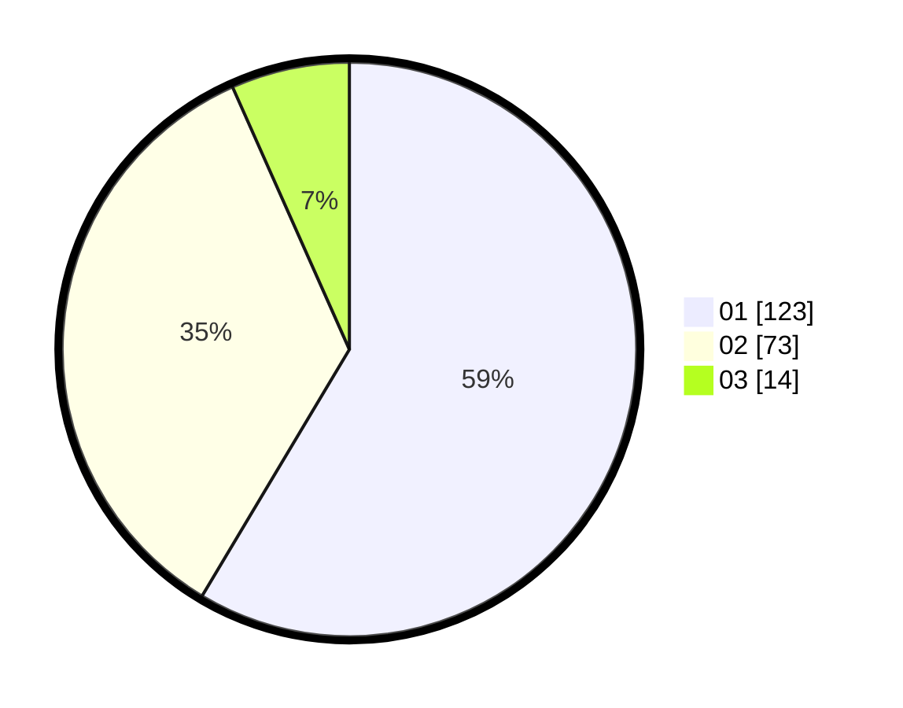

# Hasil

Hasil perolehan suara paslon dapat dilihat pada file paslon-01.txt, paslon-02.txt, dan paslon-03.txt.

Jika tidak ada, artinya data tersebut belum ada pada SIREKAP.

## Perolehan Suara

 * Paslon 01: **123**.
 * Paslon 02: **73**.
 * Paslon 03: **14**.

## Foto C Plano

https://sirekap-obj-formc.kpu.go.id/849c/pemilu/ppwp/31/75/06/10/01/3175061001143-20240214-184856--bf124dc8-afb2-4c7e-99e0-44bb73538f08.jpg

https://sirekap-obj-formc.kpu.go.id/849c/pemilu/ppwp/31/75/06/10/01/3175061001143-20240214-201301--16aef8a3-d894-48e8-a52d-dc2887cba487.jpg

https://sirekap-obj-formc.kpu.go.id/849c/pemilu/ppwp/31/75/06/10/01/3175061001143-20240214-211200--a593a698-46e3-4e15-9536-5fbed3faa205.jpg

## DATA PEMILIH TETAP

Jumlah pemilih dalam DPT: **268**.
 * L: **136**.
 * P: **132**.

## DATA PENGGUNA HAK PILIH

Jumlah pengguna hak pilih dalam DPT: **204**.
 * L: **103**.
 * P: **101**.

Jumlah pengguna hak pilih dalam DPTb: **9**.
 * L: **5**.
 * P: **4**.

Jumlah pengguna hak pilih dalam DPK: **0**.
 * L: **0**.
 * P: **0**.

Jumlah pengguna hak pilih: **213**.
 * L: **108**.
 * P: **105**.

## JUMLAH SUARA SAH DAN TIDAK SAH

JUMLAH SELURUH SUARA SAH: **210**.

JUMLAH SUARA TIDAK SAH: **3**.

JUMLAH SELURUH SUARA SAH DAN SUARA TIDAK SAH: **213**.
