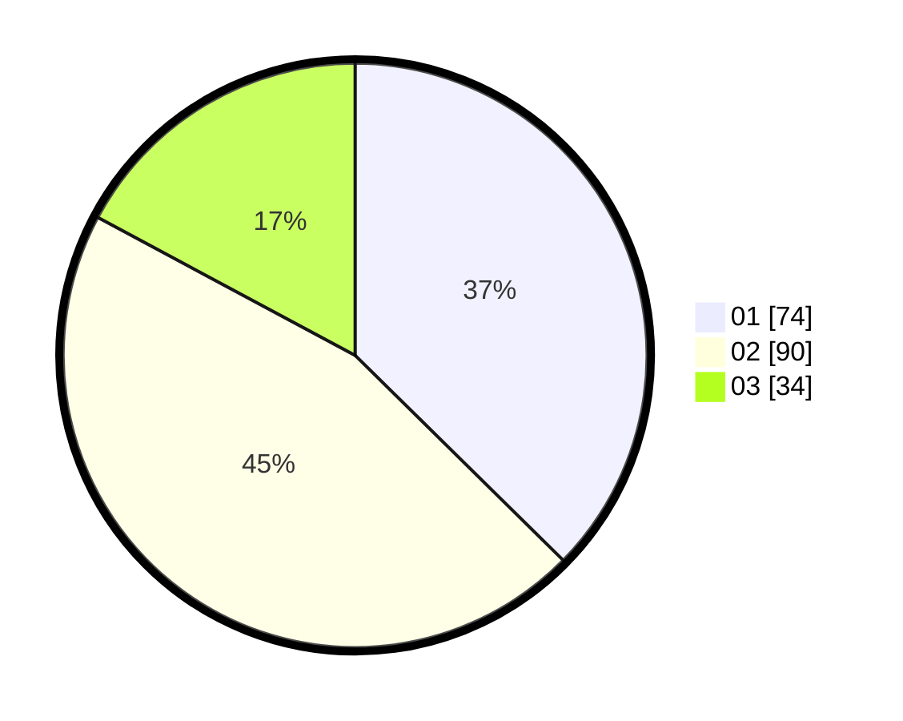

# Hasil

Hasil perolehan suara paslon dapat dilihat pada file paslon-01.txt, paslon-02.txt, dan paslon-03.txt.

Jika tidak ada, artinya data tersebut belum ada pada SIREKAP.

## Perolehan Suara

 * Paslon 01: **74**.
 * Paslon 02: **90**.
 * Paslon 03: **34**.

## Foto C Plano

https://sirekap-obj-formc.kpu.go.id/9fa6/pemilu/ppwp/31/75/06/10/01/3175061001150-20240214-195129--729e3cae-c4d4-4b54-852c-0d9a2282e1a7.jpg

https://sirekap-obj-formc.kpu.go.id/9fa6/pemilu/ppwp/31/75/06/10/01/3175061001150-20240214-195154--b8713b82-8c98-4b42-8e93-25d31dbd479f.jpg

https://sirekap-obj-formc.kpu.go.id/9fa6/pemilu/ppwp/31/75/06/10/01/3175061001150-20240214-201320--c40125e0-4c8c-43c7-ba9c-ca9dac2ac045.jpg

## DATA PEMILIH TETAP

Jumlah pemilih dalam DPT: **270**.
 * L: **131**.
 * P: **139**.

## DATA PENGGUNA HAK PILIH

Jumlah pengguna hak pilih dalam DPT: **195**.
 * L: **90**.
 * P: **105**.

Jumlah pengguna hak pilih dalam DPTb: **0**.
 * L: **0**.
 * P: **0**.

Jumlah pengguna hak pilih dalam DPK: **4**.
 * L: **2**.
 * P: **2**.

Jumlah pengguna hak pilih: **199**.
 * L: **92**.
 * P: **107**.

## JUMLAH SUARA SAH DAN TIDAK SAH

JUMLAH SELURUH SUARA SAH: **198**.

JUMLAH SUARA TIDAK SAH: **1**.

JUMLAH SELURUH SUARA SAH DAN SUARA TIDAK SAH: **199**.
