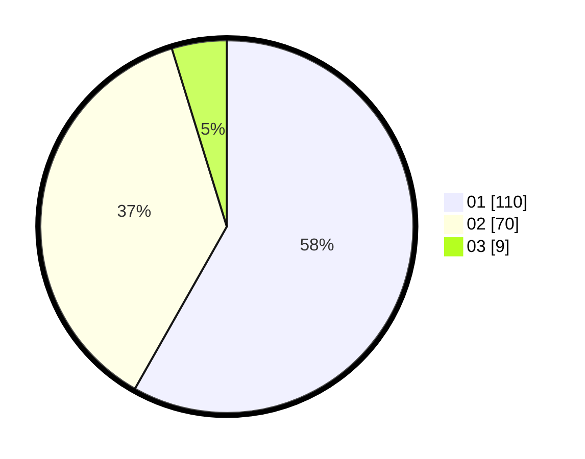

# Hasil

Hasil perolehan suara paslon dapat dilihat pada file paslon-01.txt, paslon-02.txt, dan paslon-03.txt.

Jika tidak ada, artinya data tersebut belum ada pada SIREKAP.

## Perolehan Suara

 * Paslon 01: **110**.
 * Paslon 02: **70**.
 * Paslon 03: **9**.

## Foto C Plano

https://sirekap-obj-formc.kpu.go.id/d71f/pemilu/ppwp/31/75/06/10/01/3175061001155-20240214-201335--155886e6-72ce-43f7-83ca-cd1d1f2cdb04.jpg

https://sirekap-obj-formc.kpu.go.id/d71f/pemilu/ppwp/31/75/06/10/01/3175061001155-20240214-201428--564eaa4e-9d65-4d73-88fb-31f586a8a797.jpg

https://sirekap-obj-formc.kpu.go.id/d71f/pemilu/ppwp/31/75/06/10/01/3175061001155-20240214-233522--8c3222f1-b88c-499e-815c-12197cde1668.jpg

## DATA PEMILIH TETAP

Jumlah pemilih dalam DPT: **254**.
 * L: **127**.
 * P: **127**.

## DATA PENGGUNA HAK PILIH

Jumlah pengguna hak pilih dalam DPT: **178**.
 * L: **90**.
 * P: **88**.

Jumlah pengguna hak pilih dalam DPTb: **0**.
 * L: **0**.
 * P: **0**.

Jumlah pengguna hak pilih dalam DPK: **11**.
 * L: **5**.
 * P: **6**.

Jumlah pengguna hak pilih: **189**.
 * L: **95**.
 * P: **94**.

## JUMLAH SUARA SAH DAN TIDAK SAH

JUMLAH SELURUH SUARA SAH: **189**.

JUMLAH SUARA TIDAK SAH: **0**.

JUMLAH SELURUH SUARA SAH DAN SUARA TIDAK SAH: **189**.
