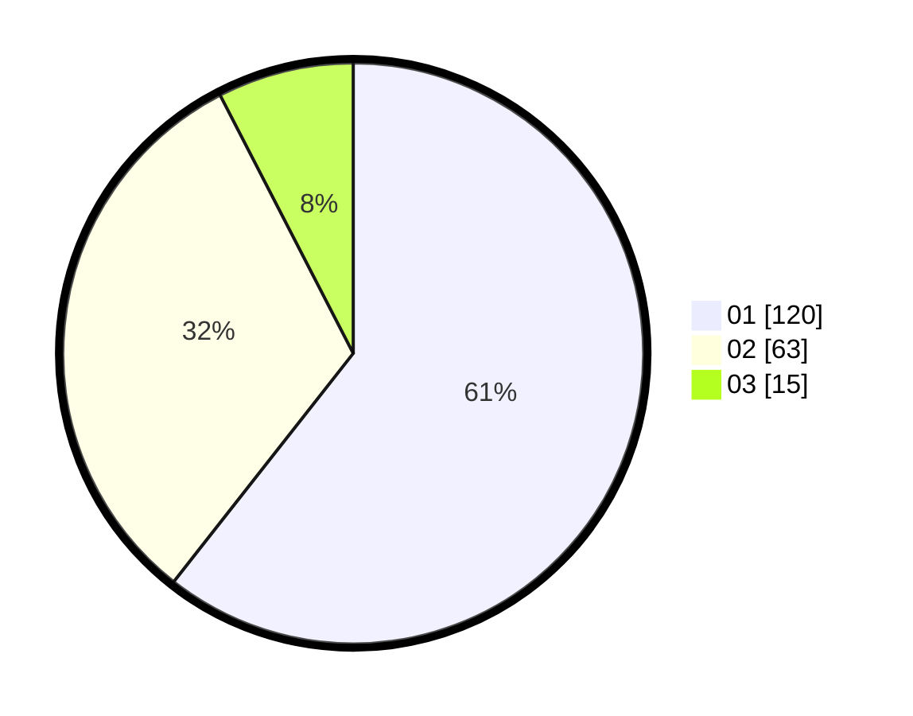

# Hasil

Hasil perolehan suara paslon dapat dilihat pada file paslon-01.txt, paslon-02.txt, dan paslon-03.txt.

Jika tidak ada, artinya data tersebut belum ada pada SIREKAP.

## Perolehan Suara

 * Paslon 01: **120**.
 * Paslon 02: **63**.
 * Paslon 03: **15**.

## Foto C Plano

https://sirekap-obj-formc.kpu.go.id/e3a7/pemilu/ppwp/31/75/06/10/01/3175061001156-20240214-215628--d94465d7-e3dc-497a-8813-641c1da906e8.jpg

https://sirekap-obj-formc.kpu.go.id/e3a7/pemilu/ppwp/31/75/06/10/01/3175061001156-20240214-221719--6b3b124c-e069-41ef-9da3-2fcbc3aa8d3c.jpg

https://sirekap-obj-formc.kpu.go.id/e3a7/pemilu/ppwp/31/75/06/10/01/3175061001156-20240219-182838--4a5f6979-7306-430f-be45-07f988ca992f.jpg

## DATA PEMILIH TETAP

Jumlah pemilih dalam DPT: **257**.
 * L: **130**.
 * P: **127**.

## DATA PENGGUNA HAK PILIH

Jumlah pengguna hak pilih dalam DPT: **199**.
 * L: **104**.
 * P: **95**.

Jumlah pengguna hak pilih dalam DPTb: **0**.
 * L: **0**.
 * P: **0**.

Jumlah pengguna hak pilih dalam DPK: **0**.
 * L: **0**.
 * P: **0**.

Jumlah pengguna hak pilih: **199**.
 * L: **104**.
 * P: **95**.

## JUMLAH SUARA SAH DAN TIDAK SAH

JUMLAH SELURUH SUARA SAH: **198**.

JUMLAH SUARA TIDAK SAH: **1**.

JUMLAH SELURUH SUARA SAH DAN SUARA TIDAK SAH: **199**.
