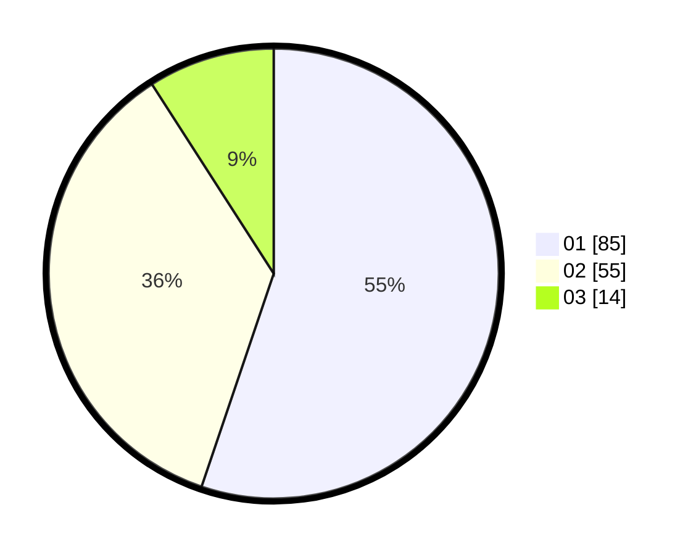

# Hasil

Hasil perolehan suara paslon dapat dilihat pada file paslon-01.txt, paslon-02.txt, dan paslon-03.txt.

Jika tidak ada, artinya data tersebut belum ada pada SIREKAP.

## Perolehan Suara

 * Paslon 01: **85**.
 * Paslon 02: **55**.
 * Paslon 03: **14**.

## Foto C Plano

https://sirekap-obj-formc.kpu.go.id/aa92/pemilu/ppwp/31/75/06/10/01/3175061001157-20240216-214346--49ecde91-3350-43a3-ad5c-53078afe0c88.jpg

https://sirekap-obj-formc.kpu.go.id/aa92/pemilu/ppwp/31/75/06/10/01/3175061001157-20240215-000037--a24a3200-7c64-4f42-9e4e-968c5492828a.jpg

https://sirekap-obj-formc.kpu.go.id/aa92/pemilu/ppwp/31/75/06/10/01/3175061001157-20240216-215325--9811ada7-e8d3-4dd7-b197-dbf039d43b42.jpg

## DATA PEMILIH TETAP

Jumlah pemilih dalam DPT: **207**.
 * L: **101**.
 * P: **106**.

## DATA PENGGUNA HAK PILIH

Jumlah pengguna hak pilih dalam DPT: **155**.
 * L: **78**.
 * P: **77**.

Jumlah pengguna hak pilih dalam DPTb: **0**.
 * L: **0**.
 * P: **0**.

Jumlah pengguna hak pilih dalam DPK: **0**.
 * L: **0**.
 * P: **0**.

Jumlah pengguna hak pilih: **155**.
 * L: **78**.
 * P: **77**.

## JUMLAH SUARA SAH DAN TIDAK SAH

JUMLAH SELURUH SUARA SAH: **155**.

JUMLAH SUARA TIDAK SAH: **0**.

JUMLAH SELURUH SUARA SAH DAN SUARA TIDAK SAH: **155**.
