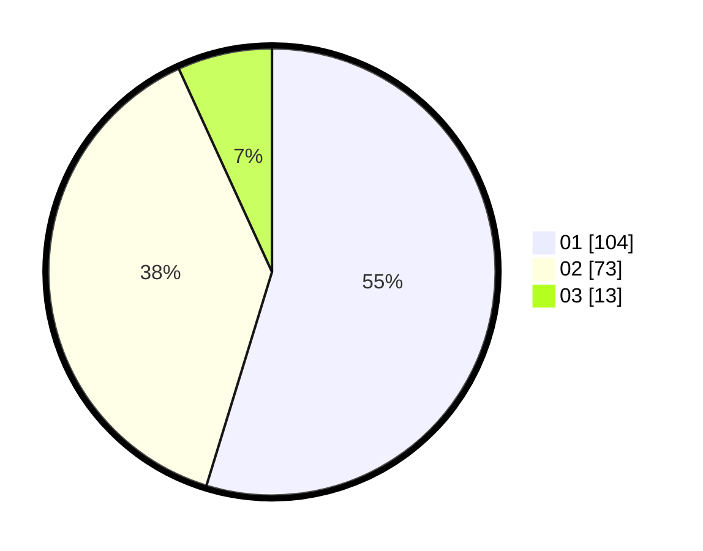

# Hasil

Hasil perolehan suara paslon dapat dilihat pada file paslon-01.txt, paslon-02.txt, dan paslon-03.txt.

Jika tidak ada, artinya data tersebut belum ada pada SIREKAP.

## Perolehan Suara

 * Paslon 01: **104**.
 * Paslon 02: **73**.
 * Paslon 03: **13**.

## Foto C Plano

https://sirekap-obj-formc.kpu.go.id/f849/pemilu/ppwp/31/75/06/10/01/3175061001159-20240214-211827--444e71ae-9fbf-4daa-a615-b88ed8aaa55c.jpg

https://sirekap-obj-formc.kpu.go.id/f849/pemilu/ppwp/31/75/06/10/01/3175061001159-20240214-211650--8c9febb4-8071-40d7-a039-8f7bb4f0ffe5.jpg

https://sirekap-obj-formc.kpu.go.id/f849/pemilu/ppwp/31/75/06/10/01/3175061001159-20240214-230341--cdfdef24-ed1b-4143-b810-ce89d946cc1d.jpg

## DATA PEMILIH TETAP

Jumlah pemilih dalam DPT: **280**.
 * L: **143**.
 * P: **137**.

## DATA PENGGUNA HAK PILIH

Jumlah pengguna hak pilih dalam DPT: **193**.
 * L: **96**.
 * P: **97**.

Jumlah pengguna hak pilih dalam DPTb: **0**.
 * L: **0**.
 * P: **0**.

Jumlah pengguna hak pilih dalam DPK: **0**.
 * L: **0**.
 * P: **0**.

Jumlah pengguna hak pilih: **193**.
 * L: **96**.
 * P: **97**.

## JUMLAH SUARA SAH DAN TIDAK SAH

JUMLAH SELURUH SUARA SAH: **190**.

JUMLAH SUARA TIDAK SAH: **4**.

JUMLAH SELURUH SUARA SAH DAN SUARA TIDAK SAH: **194**.
