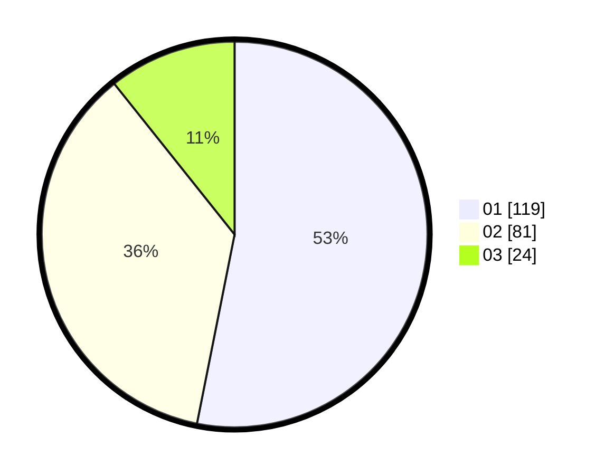

# Hasil

Hasil perolehan suara paslon dapat dilihat pada file paslon-01.txt, paslon-02.txt, dan paslon-03.txt.

Jika tidak ada, artinya data tersebut belum ada pada SIREKAP.

## Perolehan Suara

 * Paslon 01: **119**.
 * Paslon 02: **81**.
 * Paslon 03: **24**.

## Foto C Plano

https://sirekap-obj-formc.kpu.go.id/ae70/pemilu/ppwp/31/75/06/10/01/3175061001160-20240214-155024--0c38bdc6-bad4-4c72-b6c5-8754bec6096f.jpg

https://sirekap-obj-formc.kpu.go.id/ae70/pemilu/ppwp/31/75/06/10/01/3175061001160-20240214-201328--8f0248f8-ef96-4c0b-8c8b-43ea8c873dd6.jpg

https://sirekap-obj-formc.kpu.go.id/ae70/pemilu/ppwp/31/75/06/10/01/3175061001160-20240214-155153--77b0471c-f523-4b74-b77d-91feac4ea848.jpg

## DATA PEMILIH TETAP

Jumlah pemilih dalam DPT: **256**.
 * L: **117**.
 * P: **139**.

## DATA PENGGUNA HAK PILIH

Jumlah pengguna hak pilih dalam DPT: **220**.
 * L: **104**.
 * P: **116**.

Jumlah pengguna hak pilih dalam DPTb: **4**.
 * L: **2**.
 * P: **2**.

Jumlah pengguna hak pilih dalam DPK: **2**.
 * L: **1**.
 * P: **1**.

Jumlah pengguna hak pilih: **226**.
 * L: **107**.
 * P: **119**.

## JUMLAH SUARA SAH DAN TIDAK SAH

JUMLAH SELURUH SUARA SAH: **224**.

JUMLAH SUARA TIDAK SAH: **2**.

JUMLAH SELURUH SUARA SAH DAN SUARA TIDAK SAH: **226**.
