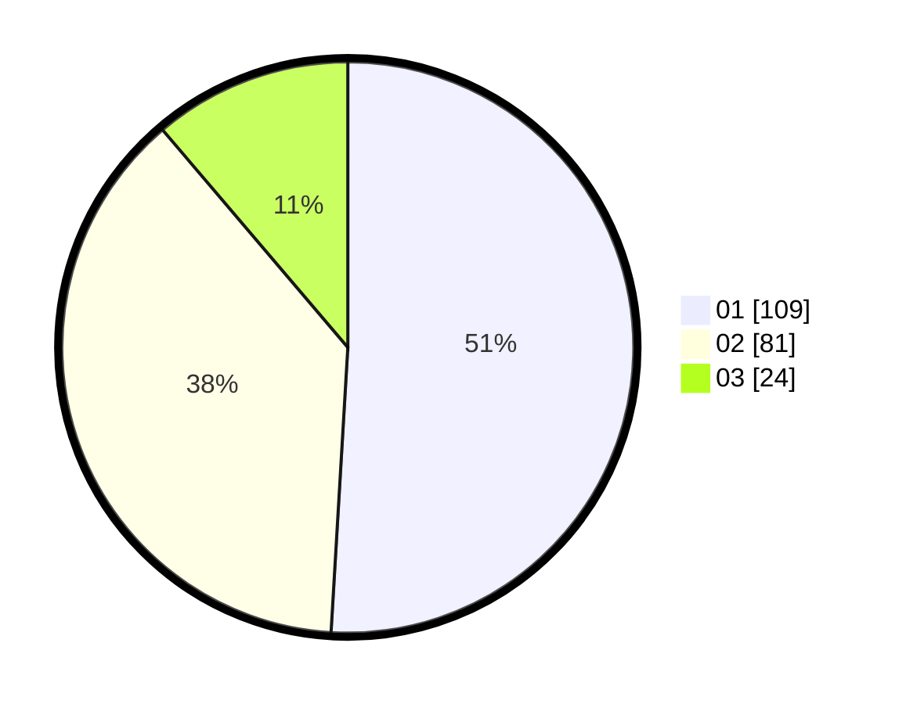

# Hasil

Hasil perolehan suara paslon dapat dilihat pada file paslon-01.txt, paslon-02.txt, dan paslon-03.txt.

Jika tidak ada, artinya data tersebut belum ada pada SIREKAP.

## Perolehan Suara

 * Paslon 01: **109**.
 * Paslon 02: **81**.
 * Paslon 03: **24**.

## Foto C Plano

https://sirekap-obj-formc.kpu.go.id/3419/pemilu/ppwp/31/75/06/10/01/3175061001167-20240214-232341--24f5a0a8-e486-470a-8d4e-ce51290da5c7.jpg

https://sirekap-obj-formc.kpu.go.id/3419/pemilu/ppwp/31/75/06/10/01/3175061001167-20240214-155107--e7c348fb-8db4-45ff-8e41-ff6a1eb9a6d7.jpg

https://sirekap-obj-formc.kpu.go.id/3419/pemilu/ppwp/31/75/06/10/01/3175061001167-20240214-232414--594d4589-700e-4ce4-9437-154c5a6df8b6.jpg
