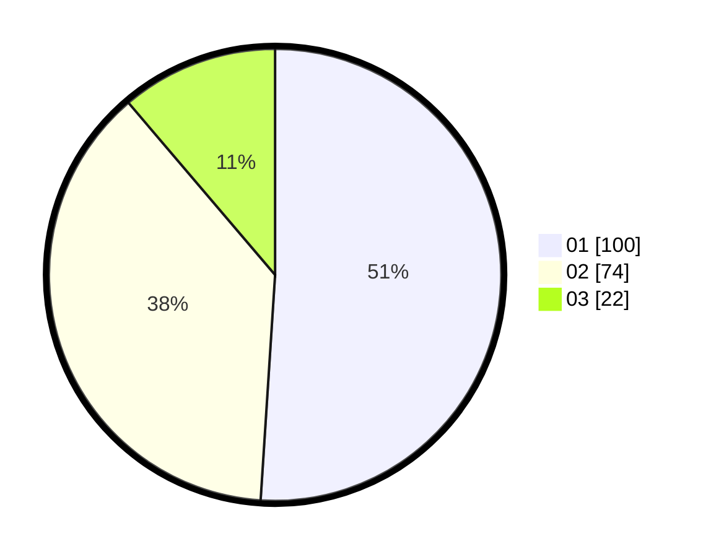

# Hasil

Hasil perolehan suara paslon dapat dilihat pada file paslon-01.txt, paslon-02.txt, dan paslon-03.txt.

Jika tidak ada, artinya data tersebut belum ada pada SIREKAP.

## Perolehan Suara

 * Paslon 01: **100**.
 * Paslon 02: **74**.
 * Paslon 03: **22**.

## Foto C Plano

https://sirekap-obj-formc.kpu.go.id/5aba/pemilu/ppwp/31/75/06/10/01/3175061001178-20240214-230426--2f9b64de-fc44-46d6-a8b4-779f7ae37a20.jpg

https://sirekap-obj-formc.kpu.go.id/5aba/pemilu/ppwp/31/75/06/10/01/3175061001178-20240214-230552--7aa31a0b-aca4-47a0-9071-e2d35dff1d5d.jpg

https://sirekap-obj-formc.kpu.go.id/5aba/pemilu/ppwp/31/75/06/10/01/3175061001178-20240217-124343--5a2cb9b2-d2b5-482b-9f8f-fffbe23808f2.jpg

## DATA PEMILIH TETAP

Jumlah pemilih dalam DPT: **272**.
 * L: **139**.
 * P: **133**.

## DATA PENGGUNA HAK PILIH

Jumlah pengguna hak pilih dalam DPT: **201**.
 * L: **105**.
 * P: **96**.

Jumlah pengguna hak pilih dalam DPTb: **0**.
 * L: **0**.
 * P: **0**.

Jumlah pengguna hak pilih dalam DPK: **1**.
 * L: **1**.
 * P: **0**.

Jumlah pengguna hak pilih: **202**.
 * L: **106**.
 * P: **96**.

## JUMLAH SUARA SAH DAN TIDAK SAH

JUMLAH SELURUH SUARA SAH: **201**.

JUMLAH SUARA TIDAK SAH: **1**.

JUMLAH SELURUH SUARA SAH DAN SUARA TIDAK SAH: **202**.
