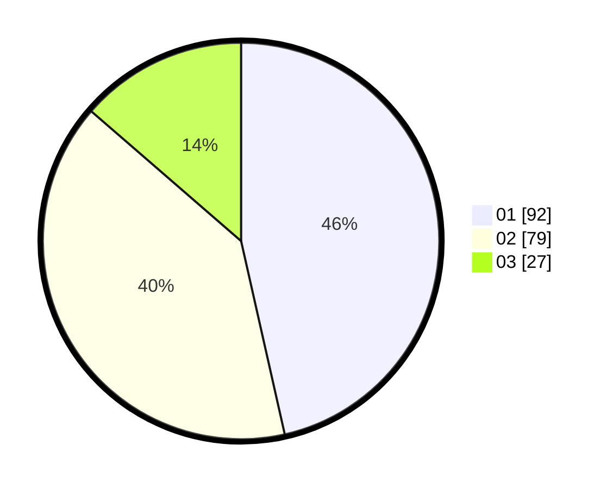

# Hasil

Hasil perolehan suara paslon dapat dilihat pada file paslon-01.txt, paslon-02.txt, dan paslon-03.txt.

Jika tidak ada, artinya data tersebut belum ada pada SIREKAP.

## Perolehan Suara

 * Paslon 01: **92**.
 * Paslon 02: **79**.
 * Paslon 03: **27**.

## Foto C Plano

https://sirekap-obj-formc.kpu.go.id/ce9a/pemilu/ppwp/31/75/06/10/01/3175061001186-20240217-154515--df55d9b2-7864-4c8f-811e-e1af5e74f463.jpg

https://sirekap-obj-formc.kpu.go.id/ce9a/pemilu/ppwp/31/75/06/10/01/3175061001186-20240216-111126--f9817b80-3c81-42d7-96ed-720285f75dce.jpg

https://sirekap-obj-formc.kpu.go.id/ce9a/pemilu/ppwp/31/75/06/10/01/3175061001186-20240216-110710--90ddf9d5-8e7a-4820-840a-f2878411f0e3.jpg
