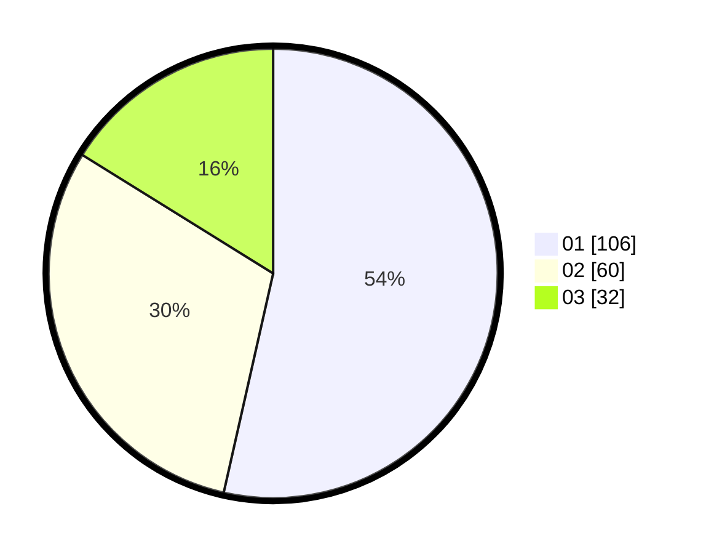

# Hasil

Hasil perolehan suara paslon dapat dilihat pada file paslon-01.txt, paslon-02.txt, dan paslon-03.txt.

Jika tidak ada, artinya data tersebut belum ada pada SIREKAP.

## Perolehan Suara

 * Paslon 01: **106**.
 * Paslon 02: **60**.
 * Paslon 03: **32**.

## Foto C Plano

https://sirekap-obj-formc.kpu.go.id/6308/pemilu/ppwp/31/75/06/10/01/3175061001198-20240214-230105--906b8ec3-9b4e-4ee8-b236-9fca62507556.jpg

https://sirekap-obj-formc.kpu.go.id/6308/pemilu/ppwp/31/75/06/10/01/3175061001198-20240214-230205--f0bee7ef-ad7b-496a-8715-05c980fa5720.jpg

https://sirekap-obj-formc.kpu.go.id/6308/pemilu/ppwp/31/75/06/10/01/3175061001198-20240214-230328--bcfc8483-3127-480e-9833-2d910d0a883d.jpg

## DATA PEMILIH TETAP

Jumlah pemilih dalam DPT: **249**.
 * L: **125**.
 * P: **124**.

## DATA PENGGUNA HAK PILIH

Jumlah pengguna hak pilih dalam DPT: **193**.
 * L: **96**.
 * P: **97**.

Jumlah pengguna hak pilih dalam DPTb: **3**.
 * L: **2**.
 * P: **1**.

Jumlah pengguna hak pilih dalam DPK: **3**.
 * L: **1**.
 * P: **2**.

Jumlah pengguna hak pilih: **199**.
 * L: **99**.
 * P: **100**.

## JUMLAH SUARA SAH DAN TIDAK SAH

JUMLAH SELURUH SUARA SAH: **198**.

JUMLAH SUARA TIDAK SAH: **1**.

JUMLAH SELURUH SUARA SAH DAN SUARA TIDAK SAH: **199**.
