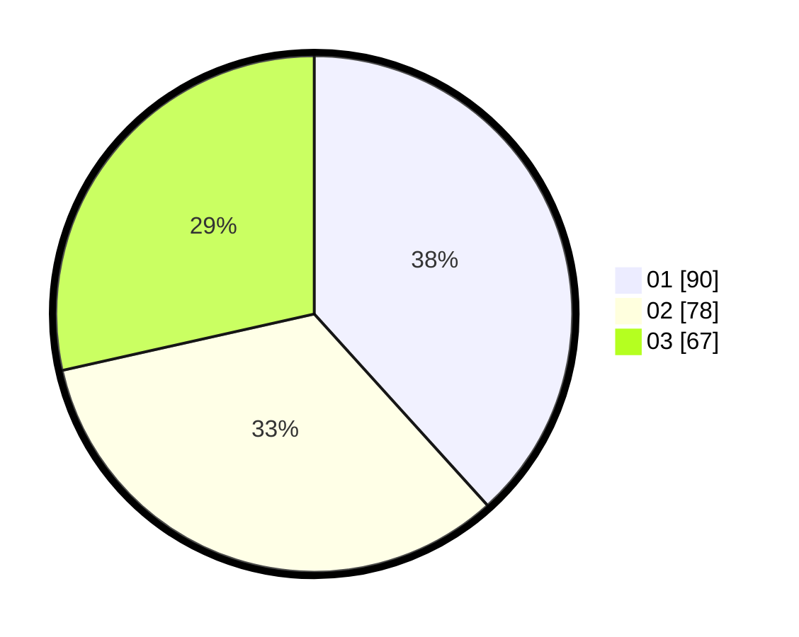

# Hasil

Hasil perolehan suara paslon dapat dilihat pada file paslon-01.txt, paslon-02.txt, dan paslon-03.txt.

Jika tidak ada, artinya data tersebut belum ada pada SIREKAP.

## Perolehan Suara

 * Paslon 01: **90**.
 * Paslon 02: **78**.
 * Paslon 03: **67**.

## Foto C Plano

https://sirekap-obj-formc.kpu.go.id/4cd9/pemilu/ppwp/31/75/06/10/01/3175061001202-20240216-205013--afe42d68-fc47-4163-aa75-15843b00e178.jpg

https://sirekap-obj-formc.kpu.go.id/4cd9/pemilu/ppwp/31/75/06/10/01/3175061001202-20240216-205156--ed7487ae-f334-4948-a5e0-0259512e8a5e.jpg

https://sirekap-obj-formc.kpu.go.id/4cd9/pemilu/ppwp/31/75/06/10/01/3175061001202-20240216-205456--7406fb9b-d681-4d9f-8407-c6ceef3915cd.jpg
