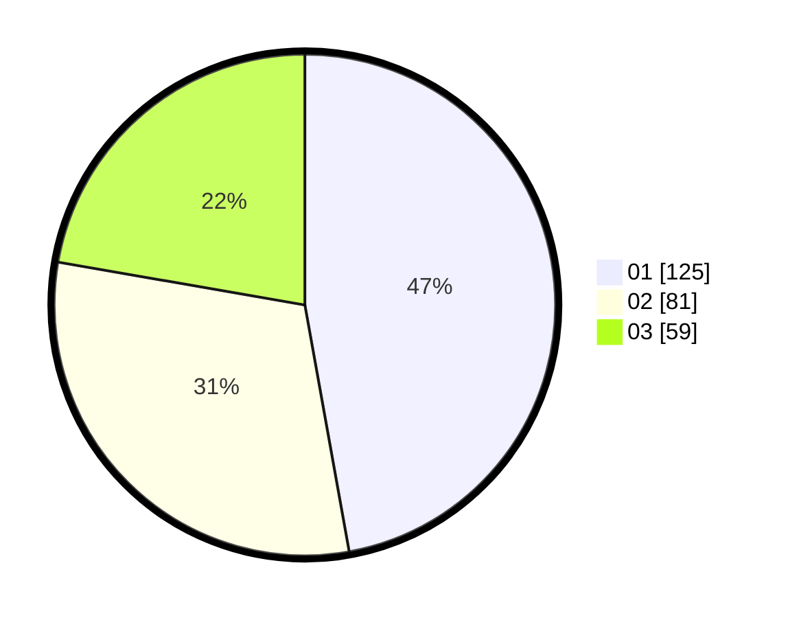

# Hasil

Hasil perolehan suara paslon dapat dilihat pada file paslon-01.txt, paslon-02.txt, dan paslon-03.txt.

Jika tidak ada, artinya data tersebut belum ada pada SIREKAP.

## Perolehan Suara

 * Paslon 01: **125**.
 * Paslon 02: **81**.
 * Paslon 03: **59**.

## Foto C Plano

https://sirekap-obj-formc.kpu.go.id/2638/pemilu/ppwp/31/75/06/10/01/3175061001204-20240214-202342--974e281e-caec-43f9-a93a-305044a074e4.jpg

https://sirekap-obj-formc.kpu.go.id/2638/pemilu/ppwp/31/75/06/10/01/3175061001204-20240214-202355--ace708f1-b6da-44d1-8538-b7d65c7ff440.jpg

https://sirekap-obj-formc.kpu.go.id/2638/pemilu/ppwp/31/75/06/10/01/3175061001204-20240214-202359--b44daaaf-8b91-46ac-b863-d16c21b7cea2.jpg

## DATA PEMILIH TETAP

Jumlah pemilih dalam DPT: **272**.
 * L: **727**.
 * P: **145**.

## DATA PENGGUNA HAK PILIH

Jumlah pengguna hak pilih dalam DPT: **236**.
 * L: **105**.
 * P: **737**.

Jumlah pengguna hak pilih dalam DPTb: **27**.
 * L: **73**.
 * P: **8**.

Jumlah pengguna hak pilih dalam DPK: **73**.
 * L: **5**.
 * P: **6**.

Jumlah pengguna hak pilih: **268**.
 * L: **123**.
 * P: **145**.

## JUMLAH SUARA SAH DAN TIDAK SAH

JUMLAH SELURUH SUARA SAH: **265**.

JUMLAH SUARA TIDAK SAH: **3**.

JUMLAH SELURUH SUARA SAH DAN SUARA TIDAK SAH: **268**.
