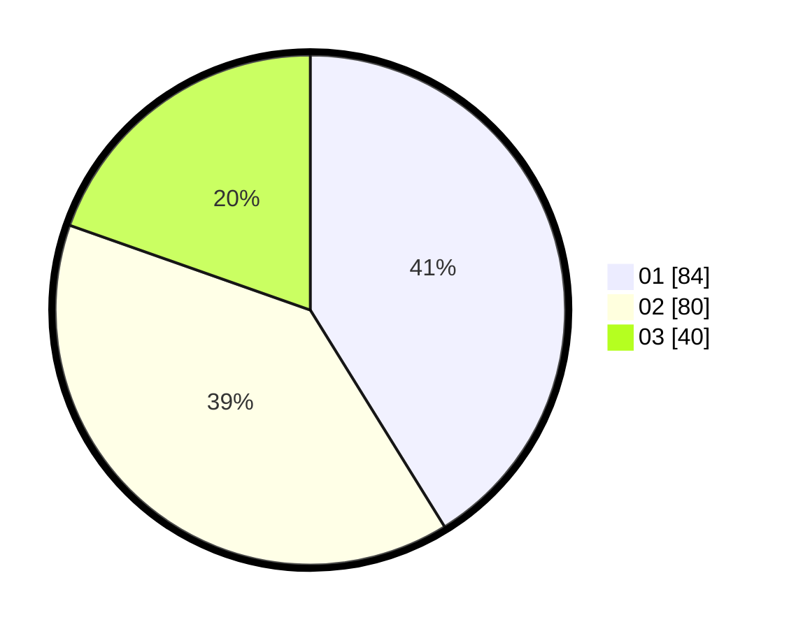

# Hasil

Hasil perolehan suara paslon dapat dilihat pada file paslon-01.txt, paslon-02.txt, dan paslon-03.txt.

Jika tidak ada, artinya data tersebut belum ada pada SIREKAP.

## Perolehan Suara

 * Paslon 01: **84**.
 * Paslon 02: **80**.
 * Paslon 03: **40**.

## Foto C Plano

https://sirekap-obj-formc.kpu.go.id/27af/pemilu/ppwp/31/75/06/10/01/3175061001210-20240215-002308--2bc52f3a-6a3a-4f35-a85d-6a06041fe0e9.jpg

https://sirekap-obj-formc.kpu.go.id/27af/pemilu/ppwp/31/75/06/10/01/3175061001210-20240215-002409--9d96f1a5-d33a-4d61-a8b7-110489e2e974.jpg

https://sirekap-obj-formc.kpu.go.id/27af/pemilu/ppwp/31/75/06/10/01/3175061001210-20240215-002503--d6d7addb-b4f4-434c-8896-9ac8f3b56a5c.jpg
