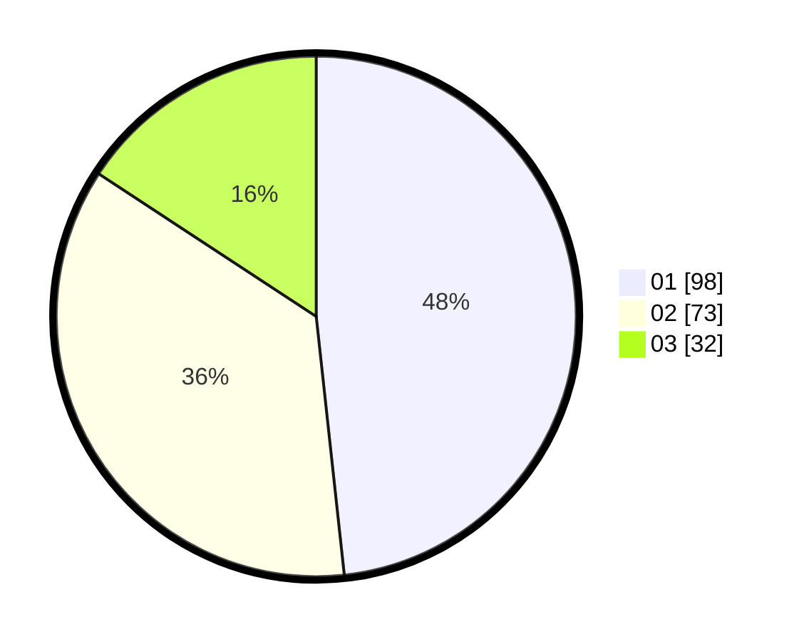

# Hasil

Hasil perolehan suara paslon dapat dilihat pada file paslon-01.txt, paslon-02.txt, dan paslon-03.txt.

Jika tidak ada, artinya data tersebut belum ada pada SIREKAP.

## Perolehan Suara

 * Paslon 01: **98**.
 * Paslon 02: **73**.
 * Paslon 03: **32**.

## Foto C Plano

https://sirekap-obj-formc.kpu.go.id/6c53/pemilu/ppwp/31/75/06/10/01/3175061001211-20240215-142851--51b2690d-8b76-44ef-b2ce-45a9364f4d29.jpg

https://sirekap-obj-formc.kpu.go.id/6c53/pemilu/ppwp/31/75/06/10/01/3175061001211-20240214-225923--355a8695-220f-4f6a-8a57-b77e406eef65.jpg
