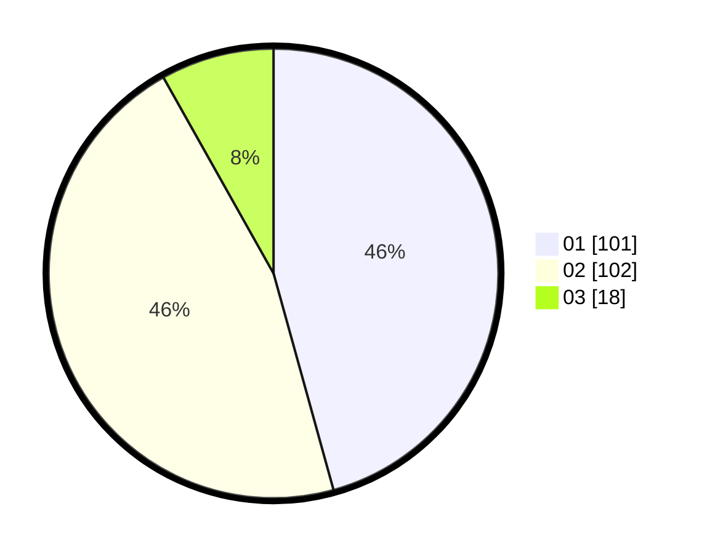

# Hasil

Hasil perolehan suara paslon dapat dilihat pada file paslon-01.txt, paslon-02.txt, dan paslon-03.txt.

Jika tidak ada, artinya data tersebut belum ada pada SIREKAP.

## Perolehan Suara

 * Paslon 01: **101**.
 * Paslon 02: **102**.
 * Paslon 03: **18**.

## Foto C Plano

https://sirekap-obj-formc.kpu.go.id/9462/pemilu/ppwp/31/75/06/10/01/3175061001212-20240214-221152--d936e855-ed16-459e-a7e4-9fe606dd9b2e.jpg

https://sirekap-obj-formc.kpu.go.id/9462/pemilu/ppwp/31/75/06/10/01/3175061001212-20240214-221506--29c6d565-cdd9-4913-b874-819b190578a9.jpg

https://sirekap-obj-formc.kpu.go.id/9462/pemilu/ppwp/31/75/06/10/01/3175061001212-20240214-221656--1c887b03-f300-4452-9724-0bb335388786.jpg
