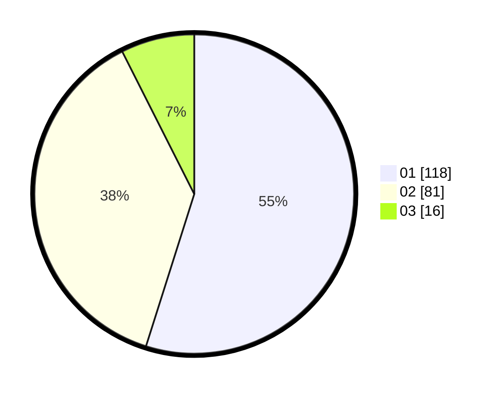

# Hasil

Hasil perolehan suara paslon dapat dilihat pada file paslon-01.txt, paslon-02.txt, dan paslon-03.txt.

Jika tidak ada, artinya data tersebut belum ada pada SIREKAP.

## Perolehan Suara

 * Paslon 01: **118**.
 * Paslon 02: **81**.
 * Paslon 03: **16**.

## Foto C Plano

https://sirekap-obj-formc.kpu.go.id/6cc8/pemilu/ppwp/31/75/06/10/01/3175061001216-20240214-205026--ee2bd5eb-6b04-46a6-bd5c-87bd59d772c8.jpg

https://sirekap-obj-formc.kpu.go.id/6cc8/pemilu/ppwp/31/75/06/10/01/3175061001216-20240214-205335--23659eac-c29b-4698-be94-2cf199625dbf.jpg

https://sirekap-obj-formc.kpu.go.id/6cc8/pemilu/ppwp/31/75/06/10/01/3175061001216-20240214-214836--8bbdd124-9bcb-40a0-9bf5-2db415740cc2.jpg
