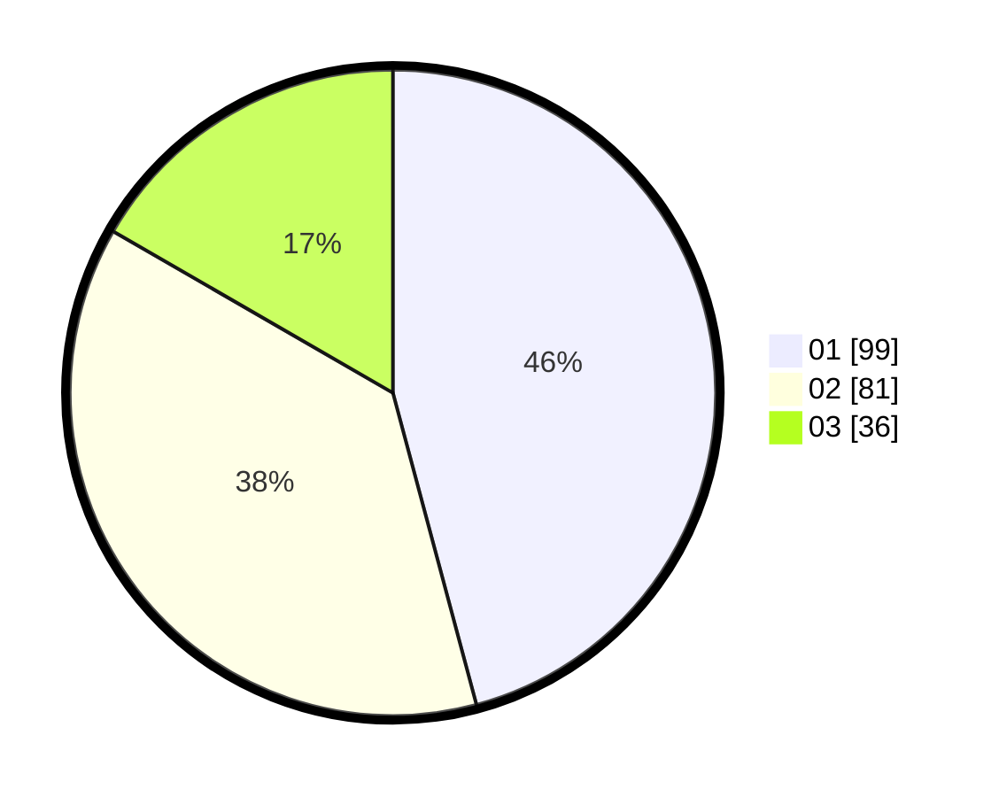

# Hasil

Hasil perolehan suara paslon dapat dilihat pada file paslon-01.txt, paslon-02.txt, dan paslon-03.txt.

Jika tidak ada, artinya data tersebut belum ada pada SIREKAP.

## Perolehan Suara

 * Paslon 01: **99**.
 * Paslon 02: **81**.
 * Paslon 03: **36**.

## Foto C Plano

https://sirekap-obj-formc.kpu.go.id/68ca/pemilu/ppwp/31/75/06/10/01/3175061001226-20240214-190303--e8c402ff-82c4-46f7-a86d-009a5869b205.jpg

https://sirekap-obj-formc.kpu.go.id/68ca/pemilu/ppwp/31/75/06/10/01/3175061001226-20240214-190912--3f812197-c390-4171-b770-25ba1fc3938f.jpg

https://sirekap-obj-formc.kpu.go.id/68ca/pemilu/ppwp/31/75/06/10/01/3175061001226-20240214-185427--ceb03173-0164-4561-aa6e-47fd3b9bca90.jpg

## DATA PEMILIH TETAP

Jumlah pemilih dalam DPT: **282**.
 * L: **135**.
 * P: **147**.

## DATA PENGGUNA HAK PILIH

Jumlah pengguna hak pilih dalam DPT: **211**.
 * L: **86**.
 * P: **125**.

Jumlah pengguna hak pilih dalam DPTb: **9**.
 * L: **2**.
 * P: **7**.

Jumlah pengguna hak pilih dalam DPK: **0**.
 * L: **0**.
 * P: **0**.

Jumlah pengguna hak pilih: **220**.
 * L: **480**.
 * P: **132**.

## JUMLAH SUARA SAH DAN TIDAK SAH

JUMLAH SELURUH SUARA SAH: **216**.

JUMLAH SUARA TIDAK SAH: **4**.

JUMLAH SELURUH SUARA SAH DAN SUARA TIDAK SAH: **220**.
