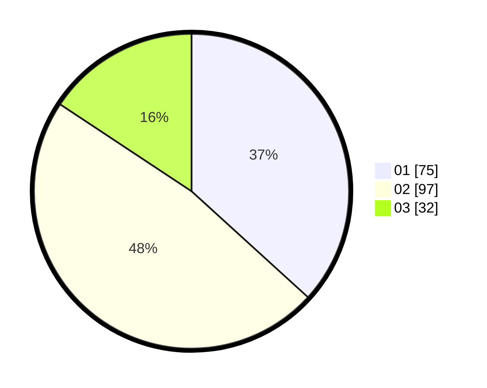

# Hasil

Hasil perolehan suara paslon dapat dilihat pada file paslon-01.txt, paslon-02.txt, dan paslon-03.txt.

Jika tidak ada, artinya data tersebut belum ada pada SIREKAP.

## Perolehan Suara

 * Paslon 01: **75**.
 * Paslon 02: **97**.
 * Paslon 03: **32**.

## Foto C Plano

https://sirekap-obj-formc.kpu.go.id/d008/pemilu/ppwp/31/75/06/10/01/3175061001233-20240214-230214--9b3e1e34-032d-4338-8165-092bd72fdeb7.jpg

https://sirekap-obj-formc.kpu.go.id/d008/pemilu/ppwp/31/75/06/10/01/3175061001233-20240214-230141--89b09948-62a9-4cab-8b6b-bb28c2aab020.jpg

https://sirekap-obj-formc.kpu.go.id/d008/pemilu/ppwp/31/75/06/10/01/3175061001233-20240214-212534--243f8473-61b9-40c9-ae2b-acf8b542ee79.jpg

## DATA PEMILIH TETAP

Jumlah pemilih dalam DPT: **267**.
 * L: **141**.
 * P: **126**.

## DATA PENGGUNA HAK PILIH

Jumlah pengguna hak pilih dalam DPT: **202**.
 * L: **100**.
 * P: **102**.

Jumlah pengguna hak pilih dalam DPTb: **1**.
 * L: **0**.
 * P: **1**.

Jumlah pengguna hak pilih dalam DPK: **3**.
 * L: **2**.
 * P: **1**.

Jumlah pengguna hak pilih: **206**.
 * L: **102**.
 * P: **104**.

## JUMLAH SUARA SAH DAN TIDAK SAH

JUMLAH SELURUH SUARA SAH: **204**.

JUMLAH SUARA TIDAK SAH: **2**.

JUMLAH SELURUH SUARA SAH DAN SUARA TIDAK SAH: **206**.
