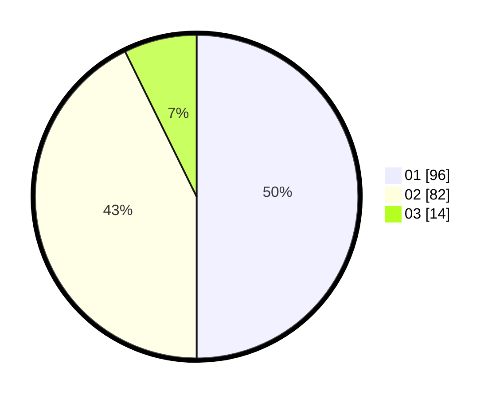

# Hasil

Hasil perolehan suara paslon dapat dilihat pada file paslon-01.txt, paslon-02.txt, dan paslon-03.txt.

Jika tidak ada, artinya data tersebut belum ada pada SIREKAP.

## Perolehan Suara

 * Paslon 01: **96**.
 * Paslon 02: **82**.
 * Paslon 03: **14**.

## Foto C Plano

https://sirekap-obj-formc.kpu.go.id/02a8/pemilu/ppwp/31/75/06/10/01/3175061001236-20240214-204510--8a8606ad-a216-4d67-be43-607786d45532.jpg

https://sirekap-obj-formc.kpu.go.id/02a8/pemilu/ppwp/31/75/06/10/01/3175061001236-20240214-204632--0340ad50-5816-4714-a35a-c69aeeb249f2.jpg

https://sirekap-obj-formc.kpu.go.id/02a8/pemilu/ppwp/31/75/06/10/01/3175061001236-20240214-204738--926fbdc7-661a-4cd0-8358-514eaf273245.jpg

## DATA PEMILIH TETAP

Jumlah pemilih dalam DPT: **263**.
 * L: **138**.
 * P: **125**.

## DATA PENGGUNA HAK PILIH

Jumlah pengguna hak pilih dalam DPT: **191**.
 * L: **100**.
 * P: **91**.

Jumlah pengguna hak pilih dalam DPTb: **0**.
 * L: **0**.
 * P: **0**.

Jumlah pengguna hak pilih dalam DPK: **2**.
 * L: **2**.
 * P: **0**.

Jumlah pengguna hak pilih: **193**.
 * L: **102**.
 * P: **91**.

## JUMLAH SUARA SAH DAN TIDAK SAH

JUMLAH SELURUH SUARA SAH: **192**.

JUMLAH SUARA TIDAK SAH: **1**.

JUMLAH SELURUH SUARA SAH DAN SUARA TIDAK SAH: **193**.
