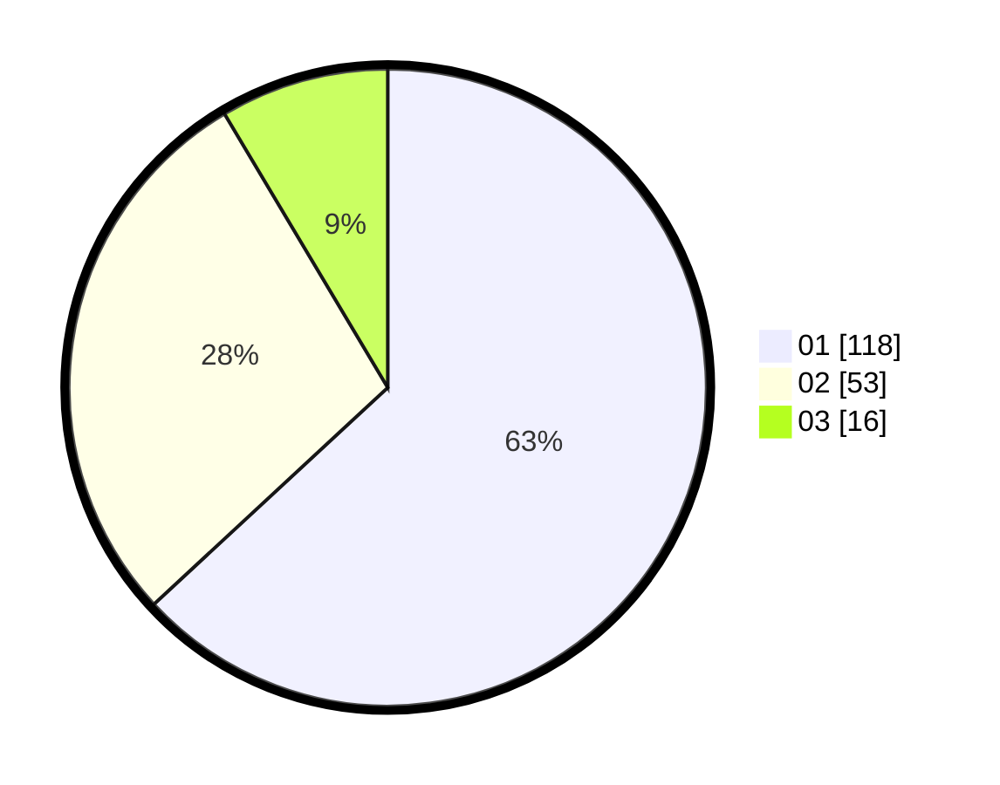

# Hasil

Hasil perolehan suara paslon dapat dilihat pada file paslon-01.txt, paslon-02.txt, dan paslon-03.txt.

Jika tidak ada, artinya data tersebut belum ada pada SIREKAP.

## Perolehan Suara

 * Paslon 01: **118**.
 * Paslon 02: **53**.
 * Paslon 03: **16**.

## Foto C Plano

https://sirekap-obj-formc.kpu.go.id/8999/pemilu/ppwp/31/75/06/10/01/3175061001242-20240214-211846--38516acf-3c79-4a63-92b2-48bf83d2bdf4.jpg

https://sirekap-obj-formc.kpu.go.id/8999/pemilu/ppwp/31/75/06/10/01/3175061001242-20240214-211917--d457c8b5-a080-4884-8eec-76cdc149c6c4.jpg

https://sirekap-obj-formc.kpu.go.id/8999/pemilu/ppwp/31/75/06/10/01/3175061001242-20240214-211951--bc042ef1-a65a-4e04-bb9c-765652d0540b.jpg

## DATA PEMILIH TETAP

Jumlah pemilih dalam DPT: **242**.
 * L: **126**.
 * P: **116**.

## DATA PENGGUNA HAK PILIH

Jumlah pengguna hak pilih dalam DPT: **192**.
 * L: **102**.
 * P: **90**.

Jumlah pengguna hak pilih dalam DPTb: **0**.
 * L: **0**.
 * P: **0**.

Jumlah pengguna hak pilih dalam DPK: **0**.
 * L: **0**.
 * P: **0**.

Jumlah pengguna hak pilih: **192**.
 * L: **102**.
 * P: **90**.

## JUMLAH SUARA SAH DAN TIDAK SAH

JUMLAH SELURUH SUARA SAH: **187**.

JUMLAH SUARA TIDAK SAH: **5**.

JUMLAH SELURUH SUARA SAH DAN SUARA TIDAK SAH: **192**.
