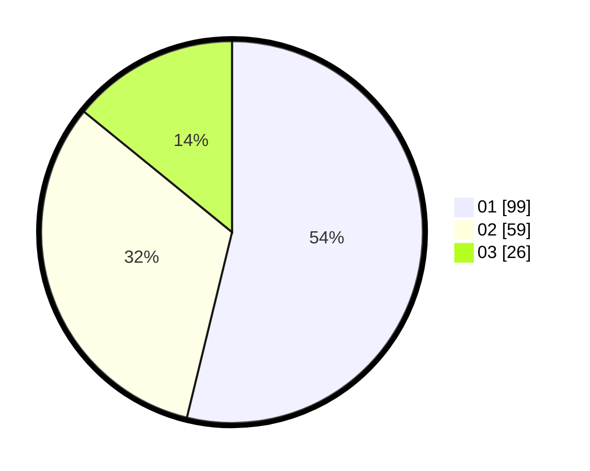

# Hasil

Hasil perolehan suara paslon dapat dilihat pada file paslon-01.txt, paslon-02.txt, dan paslon-03.txt.

Jika tidak ada, artinya data tersebut belum ada pada SIREKAP.

## Perolehan Suara

 * Paslon 01: **99**.
 * Paslon 02: **59**.
 * Paslon 03: **26**.

## Foto C Plano

https://sirekap-obj-formc.kpu.go.id/fc67/pemilu/ppwp/31/75/06/10/01/3175061001243-20240214-203804--27312aba-d2e9-4e0f-b68f-61bb9be7119a.jpg

https://sirekap-obj-formc.kpu.go.id/fc67/pemilu/ppwp/31/75/06/10/01/3175061001243-20240214-203850--510d8db3-4c68-441f-9edd-e1de471ec117.jpg

https://sirekap-obj-formc.kpu.go.id/fc67/pemilu/ppwp/31/75/06/10/01/3175061001243-20240214-203933--904454ed-a8df-4d46-8a55-b80ea5dde1b0.jpg
