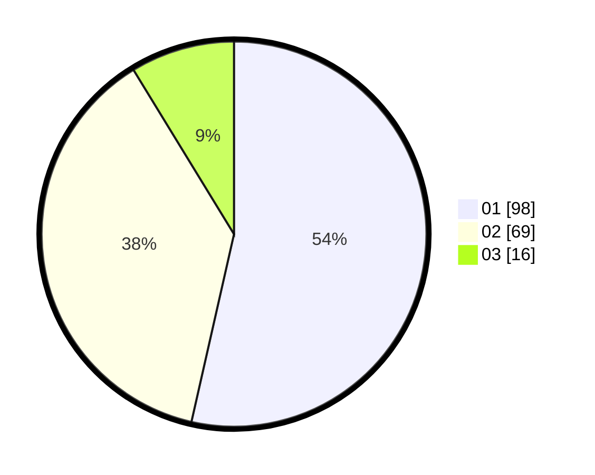

# Hasil

Hasil perolehan suara paslon dapat dilihat pada file paslon-01.txt, paslon-02.txt, dan paslon-03.txt.

Jika tidak ada, artinya data tersebut belum ada pada SIREKAP.

## Perolehan Suara

 * Paslon 01: **98**.
 * Paslon 02: **69**.
 * Paslon 03: **16**.

## Foto C Plano

https://sirekap-obj-formc.kpu.go.id/8998/pemilu/ppwp/31/75/06/10/01/3175061001251-20240214-205616--ece257e3-e3af-45bc-8171-c7a8ab37148e.jpg

https://sirekap-obj-formc.kpu.go.id/8998/pemilu/ppwp/31/75/06/10/01/3175061001251-20240214-210524--fb9f1a79-9d53-485c-8adb-6e6ee299bf81.jpg

https://sirekap-obj-formc.kpu.go.id/8998/pemilu/ppwp/31/75/06/10/01/3175061001251-20240214-210600--2013d794-adff-4731-baf0-050c44d71e04.jpg
