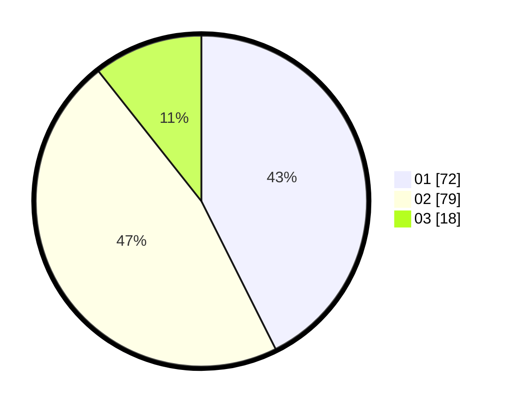

# Hasil

Hasil perolehan suara paslon dapat dilihat pada file paslon-01.txt, paslon-02.txt, dan paslon-03.txt.

Jika tidak ada, artinya data tersebut belum ada pada SIREKAP.

## Perolehan Suara

 * Paslon 01: **72**.
 * Paslon 02: **79**.
 * Paslon 03: **18**.

## Foto C Plano

https://sirekap-obj-formc.kpu.go.id/b755/pemilu/ppwp/31/75/06/10/01/3175061001256-20240214-225320--ff92b16c-7099-4bd2-b3b2-27bda8d7b97f.jpg

https://sirekap-obj-formc.kpu.go.id/b755/pemilu/ppwp/31/75/06/10/01/3175061001256-20240214-213019--4fb60e3b-6385-4746-ac99-c84c14bf9f2c.jpg

https://sirekap-obj-formc.kpu.go.id/b755/pemilu/ppwp/31/75/06/10/01/3175061001256-20240214-213213--9a07f322-c173-4913-8e28-4ab1511f3f16.jpg
