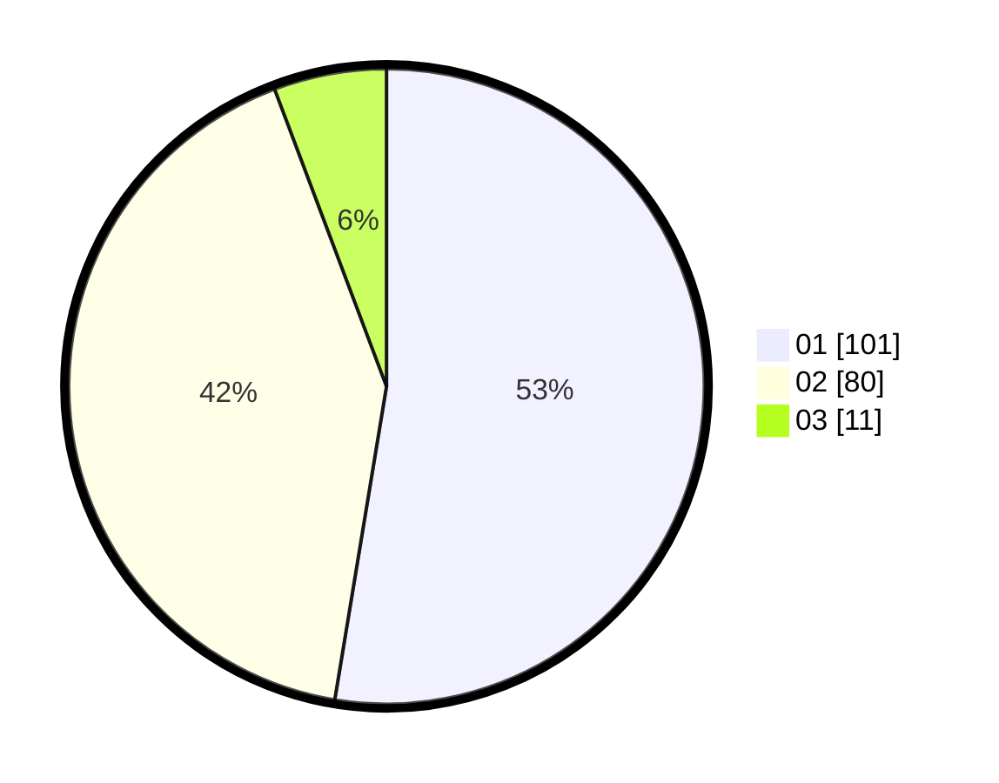

# Hasil

Hasil perolehan suara paslon dapat dilihat pada file paslon-01.txt, paslon-02.txt, dan paslon-03.txt.

Jika tidak ada, artinya data tersebut belum ada pada SIREKAP.

## Perolehan Suara

 * Paslon 01: **101**.
 * Paslon 02: **80**.
 * Paslon 03: **11**.

## Foto C Plano

https://sirekap-obj-formc.kpu.go.id/f846/pemilu/ppwp/31/75/06/10/01/3175061001266-20240214-204851--9c7b8415-ef0c-4b13-80da-34af6ef146f2.jpg

https://sirekap-obj-formc.kpu.go.id/f846/pemilu/ppwp/31/75/06/10/01/3175061001266-20240214-204727--08005ff5-b6e1-47b5-8d2e-b206b7567fb0.jpg

https://sirekap-obj-formc.kpu.go.id/f846/pemilu/ppwp/31/75/06/10/01/3175061001266-20240214-201947--08928641-e8f5-4466-9e78-4ccaec6f7f5a.jpg

## DATA PEMILIH TETAP

Jumlah pemilih dalam DPT: **240**.
 * L: **115**.
 * P: **125**.

## DATA PENGGUNA HAK PILIH

Jumlah pengguna hak pilih dalam DPT: **189**.
 * L: **84**.
 * P: **105**.

Jumlah pengguna hak pilih dalam DPTb: **0**.
 * L: **0**.
 * P: **0**.

Jumlah pengguna hak pilih dalam DPK: **4**.
 * L: **3**.
 * P: **1**.

Jumlah pengguna hak pilih: **193**.
 * L: **87**.
 * P: **106**.

## JUMLAH SUARA SAH DAN TIDAK SAH

JUMLAH SELURUH SUARA SAH: **192**.

JUMLAH SUARA TIDAK SAH: **1**.

JUMLAH SELURUH SUARA SAH DAN SUARA TIDAK SAH: **193**.
