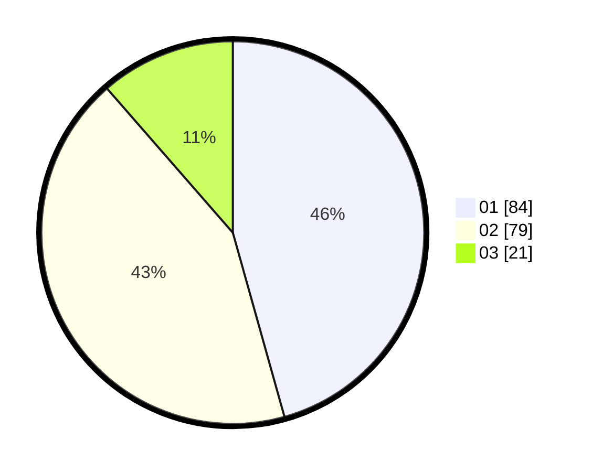

# Hasil

Hasil perolehan suara paslon dapat dilihat pada file paslon-01.txt, paslon-02.txt, dan paslon-03.txt.

Jika tidak ada, artinya data tersebut belum ada pada SIREKAP.

## Perolehan Suara

 * Paslon 01: **84**.
 * Paslon 02: **79**.
 * Paslon 03: **21**.

## Foto C Plano

https://sirekap-obj-formc.kpu.go.id/df3a/pemilu/ppwp/31/75/06/10/01/3175061001274-20240214-155046--8032c94e-9d51-4f91-a86b-1ad5e3672d38.jpg

https://sirekap-obj-formc.kpu.go.id/df3a/pemilu/ppwp/31/75/06/10/01/3175061001274-20240214-155135--85c9d55d-992b-4d1a-8b5c-74643c0a4a8a.jpg

https://sirekap-obj-formc.kpu.go.id/df3a/pemilu/ppwp/31/75/06/10/01/3175061001274-20240214-155215--3f371bab-4e2f-4a11-a28f-c851c9f6d36e.jpg

## DATA PEMILIH TETAP

Jumlah pemilih dalam DPT: **246**.
 * L: **132**.
 * P: **114**.

## DATA PENGGUNA HAK PILIH

Jumlah pengguna hak pilih dalam DPT: **184**.
 * L: **94**.
 * P: **90**.

Jumlah pengguna hak pilih dalam DPTb: **224**.
 * L: **22**.
 * P: **282**.

Jumlah pengguna hak pilih dalam DPK: **0**.
 * L: **0**.
 * P: **0**.

Jumlah pengguna hak pilih: **188**.
 * L: **96**.
 * P: **92**.

## JUMLAH SUARA SAH DAN TIDAK SAH

JUMLAH SELURUH SUARA SAH: **184**.

JUMLAH SUARA TIDAK SAH: **4**.

JUMLAH SELURUH SUARA SAH DAN SUARA TIDAK SAH: **188**.
