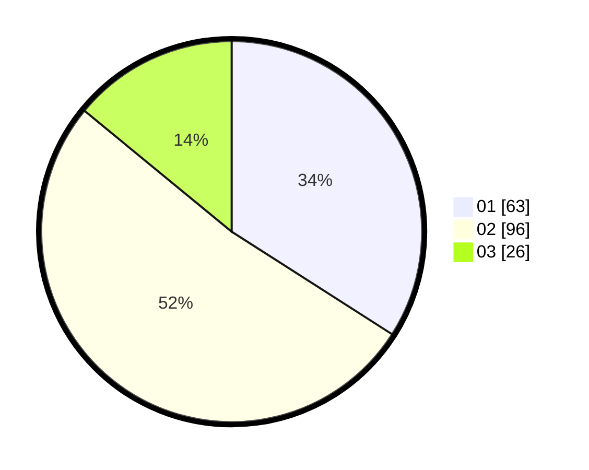

# Hasil

Hasil perolehan suara paslon dapat dilihat pada file paslon-01.txt, paslon-02.txt, dan paslon-03.txt.

Jika tidak ada, artinya data tersebut belum ada pada SIREKAP.

## Perolehan Suara

 * Paslon 01: **63**.
 * Paslon 02: **96**.
 * Paslon 03: **26**.

## Foto C Plano

https://sirekap-obj-formc.kpu.go.id/aeb0/pemilu/ppwp/31/75/06/10/01/3175061001279-20240216-001340--19aa5f71-d489-4546-bbcd-84dbe8d95d1b.jpg

https://sirekap-obj-formc.kpu.go.id/aeb0/pemilu/ppwp/31/75/06/10/01/3175061001279-20240214-200852--fe47ceef-7295-407d-ac9b-70aff68ea2cd.jpg

https://sirekap-obj-formc.kpu.go.id/aeb0/pemilu/ppwp/31/75/06/10/01/3175061001279-20240214-200124--c39ebc00-8258-445b-82f8-498ed5145126.jpg

## DATA PEMILIH TETAP

Jumlah pemilih dalam DPT: **268**.
 * L: **140**.
 * P: **128**.

## DATA PENGGUNA HAK PILIH

Jumlah pengguna hak pilih dalam DPT: **184**.
 * L: **87**.
 * P: **97**.

Jumlah pengguna hak pilih dalam DPTb: **0**.
 * L: **0**.
 * P: **0**.

Jumlah pengguna hak pilih dalam DPK: **1**.
 * L: **0**.
 * P: **1**.

Jumlah pengguna hak pilih: **185**.
 * L: **87**.
 * P: **98**.

## JUMLAH SUARA SAH DAN TIDAK SAH

JUMLAH SELURUH SUARA SAH: **185**.

JUMLAH SUARA TIDAK SAH: **0**.

JUMLAH SELURUH SUARA SAH DAN SUARA TIDAK SAH: **185**.
