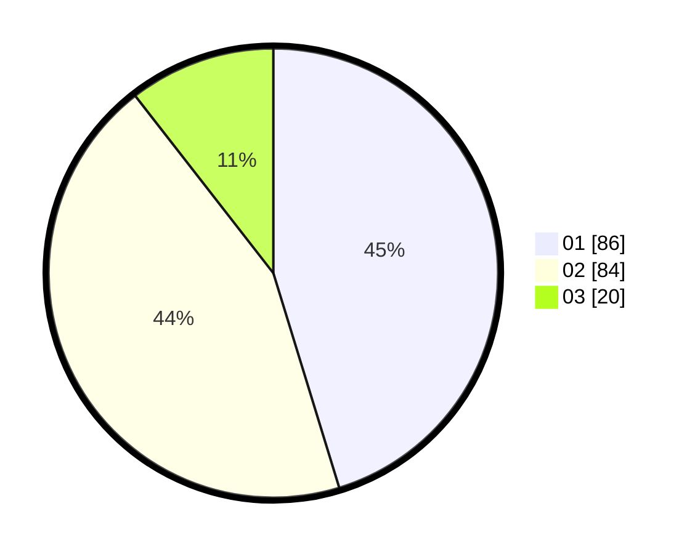

# Hasil

Hasil perolehan suara paslon dapat dilihat pada file paslon-01.txt, paslon-02.txt, dan paslon-03.txt.

Jika tidak ada, artinya data tersebut belum ada pada SIREKAP.

## Perolehan Suara

 * Paslon 01: **86**.
 * Paslon 02: **84**.
 * Paslon 03: **20**.

## Foto C Plano

https://sirekap-obj-formc.kpu.go.id/63c8/pemilu/ppwp/31/75/06/10/01/3175061001283-20240214-155733--8d2d03ce-3c3b-4f8e-aa40-e94d156409a4.jpg

https://sirekap-obj-formc.kpu.go.id/63c8/pemilu/ppwp/31/75/06/10/01/3175061001283-20240214-231155--2039c6c5-1ec3-4f7d-b298-bc7d70828680.jpg

https://sirekap-obj-formc.kpu.go.id/63c8/pemilu/ppwp/31/75/06/10/01/3175061001283-20240214-192945--7b4c9de2-4efa-4278-8c84-0342e3407a1e.jpg

## DATA PEMILIH TETAP

Jumlah pemilih dalam DPT: **271**.
 * L: **135**.
 * P: **136**.

## DATA PENGGUNA HAK PILIH

Jumlah pengguna hak pilih dalam DPT: **194**.
 * L: **90**.
 * P: **104**.

Jumlah pengguna hak pilih dalam DPTb: **0**.
 * L: **0**.
 * P: **0**.

Jumlah pengguna hak pilih dalam DPK: **0**.
 * L: **0**.
 * P: **0**.

Jumlah pengguna hak pilih: **194**.
 * L: **90**.
 * P: **104**.

## JUMLAH SUARA SAH DAN TIDAK SAH

JUMLAH SELURUH SUARA SAH: **190**.

JUMLAH SUARA TIDAK SAH: **4**.

JUMLAH SELURUH SUARA SAH DAN SUARA TIDAK SAH: **194**.
