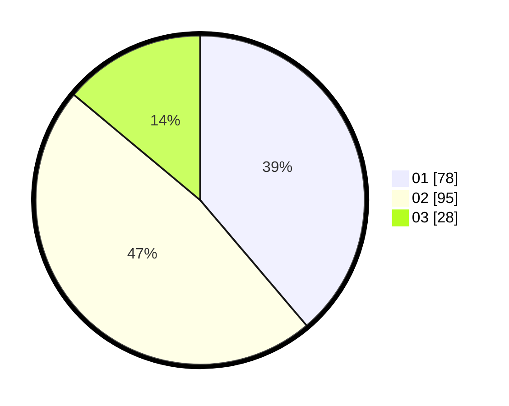

# Hasil

Hasil perolehan suara paslon dapat dilihat pada file paslon-01.txt, paslon-02.txt, dan paslon-03.txt.

Jika tidak ada, artinya data tersebut belum ada pada SIREKAP.

## Perolehan Suara

 * Paslon 01: **78**.
 * Paslon 02: **95**.
 * Paslon 03: **28**.

## Foto C Plano

https://sirekap-obj-formc.kpu.go.id/0766/pemilu/ppwp/31/75/06/10/01/3175061001286-20240214-192930--49b62381-4b2d-48e5-9573-c04fb1a80033.jpg

https://sirekap-obj-formc.kpu.go.id/0766/pemilu/ppwp/31/75/06/10/01/3175061001286-20240214-194957--cfe21aa4-94b3-42a8-83fd-7a06bfd4db8a.jpg

https://sirekap-obj-formc.kpu.go.id/0766/pemilu/ppwp/31/75/06/10/01/3175061001286-20240214-195238--de20bb79-865d-41bb-a346-9b63a2e23acb.jpg

## DATA PEMILIH TETAP

Jumlah pemilih dalam DPT: **262**.
 * L: **131**.
 * P: **131**.

## DATA PENGGUNA HAK PILIH

Jumlah pengguna hak pilih dalam DPT: **193**.
 * L: **94**.
 * P: **99**.

Jumlah pengguna hak pilih dalam DPTb: **3**.
 * L: **1**.
 * P: **2**.

Jumlah pengguna hak pilih dalam DPK: **7**.
 * L: **4**.
 * P: **3**.

Jumlah pengguna hak pilih: **203**.
 * L: **99**.
 * P: **104**.

## JUMLAH SUARA SAH DAN TIDAK SAH

JUMLAH SELURUH SUARA SAH: **201**.

JUMLAH SUARA TIDAK SAH: **2**.

JUMLAH SELURUH SUARA SAH DAN SUARA TIDAK SAH: **203**.
