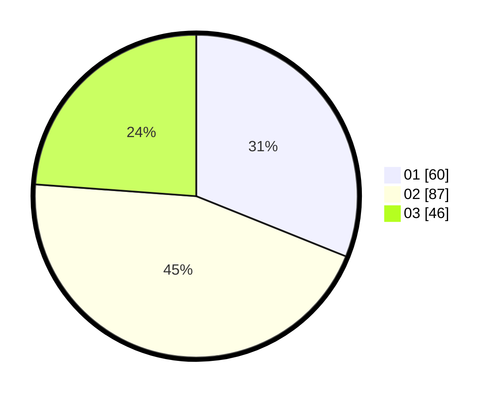

# Hasil

Hasil perolehan suara paslon dapat dilihat pada file paslon-01.txt, paslon-02.txt, dan paslon-03.txt.

Jika tidak ada, artinya data tersebut belum ada pada SIREKAP.

## Perolehan Suara

 * Paslon 01: **60**.
 * Paslon 02: **87**.
 * Paslon 03: **46**.

## Foto C Plano

https://sirekap-obj-formc.kpu.go.id/f197/pemilu/ppwp/31/75/06/10/01/3175061001287-20240216-112755--bff64bb3-b9bf-437b-82d7-488751ea480c.jpg

https://sirekap-obj-formc.kpu.go.id/f197/pemilu/ppwp/31/75/06/10/01/3175061001287-20240216-114858--9041b929-e052-4923-b65c-36bf1359c28f.jpg

https://sirekap-obj-formc.kpu.go.id/f197/pemilu/ppwp/31/75/06/10/01/3175061001287-20240216-113605--03d7d004-74fe-4cbd-9165-8cb125062ab5.jpg
